**OpenETran**

**An Open-Source Electromagnetic Transient Program**

During the period from 1990 through 2002, EPRI funded the development of
a Lightning Protection Design Workstation (LPDW), which was used by many
utilities to assess the lightning performance of distribution lines.
Since about 2002, this program has not been available. EPRI decided to
release the simulation kernel of LPDW under the name OpenETran, with an
open-source license (GPL v3), so it may be incorporated into IEEE Flash
and other projects.

OpenETran can presently simulate multi-conductor power lines,
insulators, surge arresters, non-linear grounds, and lightning strokes.
It efficiently calculates energy and charge duty on surge arresters, and
iterates to find the critical lightning current causing flashover on one
or more phases. It is also suitable for use in substation insulation
coordination. Capacitor switching, TRV, and other applications may be
added.

EPRI originally had permission to use code from the Numerical Recipes
book in LPDW. These routines have been removed in favor of the GNU
Scientific Library (GSL), which also uses the GPL v3 license. As a
result, the OpenETran package can be freely used and modified, but not
commercialized.

There are few error checks on the input data, and no checks on whether
the data is reasonable. It may be possible to "crash" the console-mode
version of this program with inappropriate input data. However,
graphical user interface has been provided for more convenient input,
plotting, and critical current estimates.

Copyright and License 
======================

*Copyright (c) 1992, 1994, 1998, 2002, 2011, 2012, *

*Electric Power Research Institute, Inc. *

*All rights reserved.*

*This file is part of OpenETran. *

*OpenETran is free software: you can redistribute it and/or modify it
under the terms of the GNU General Public License as published by the
Free Software Foundation, either version 3 of the License, or (at your
option) any later version. *

*OpenETran is distributed in the hope that it will be useful, but
WITHOUT ANY WARRANTY; without even the implied warranty of
MERCHANTABILITY or FITNESS FOR A PARTICULAR PURPOSE. See the GNU General
Public License for more details. *

*You should have received a copy of the GNU General Public License along
with OpenETran. If not, see <http://www.gnu.org/licenses/>.*

*
*

Introduction
============

This program simulates the effect of direct lightning flashes to
electric power distribution lines. The main application would be
analysis of the effect of surge arresters, pole grounding, and
insulation strength on the flashover rate from direct flashes to the
line. A planned enhancement to the program will simulate nearby
lightning flashes. Another application is the simulation of surges
entering a substation from a shielding failure or backflash out on the
line.

The solution algorithms are similar to those used in the "industry
standard" Electromagnetic Transients program (EMTP) [1]. However, the
program input and overall structure have been customized and simplified
for this particular application.

Figure 1 shows the circuit structure analyzed for overhead lines. It
includes a series of one or more poles, with each pole connected by a
section of line with one or more conductors. One conductor, typically
the neutral, may be grounded at selected poles or at all poles. Each
line section must have the same span length and conductor configuration.
Figure 1 also shows optional features, connected to some of the poles.
These include:

1. Insulators

2. Surge arresters

3. Terminations, with optional D.C. voltage bias

4. Meters for plotted voltage output

5. Meters for arrester, pole ground, and service drop currents

6. Surge current to represent a direct flash to a conductor

The program can also simulate lumped resistors, inductors, and
capacitors. However, it is not suitable for the study of switching
transients. References [2-5] describe methods of simulating induced
voltages from nearby lightning strokes. However, this has not been
implemented in OpenETran yet.

|image0|

Figure 1: The circuit structure is a series of poles and line sections

Quick Start
===========

Installation
------------

The program is distributed as a Python package. It needs Python 3.5.3 or
greater to work. In order to install it, the user first needs to
download and install Python from the website
`www.python.org/downloads <http://www.python.org/downloads>`__. In
Python, the module needed to install packages is called “pip” and is
already integrated into the Python installation in versions 3.5.3 and
greater. The application “pip” is located in the “Scripts” in the Python
installation folder.

If the OpenETran software is already on the user’s computer in a
prebuilt “.whl” wheel format, the user needs to open the Windows command
prompt and use the command “pip install
PATH\\OpenETran\_win-1.0.0-py3-none-any.whl”, with PATH being the path
of the archive on the computer. Pip will then download the dependencies
and install the software automatically. An executable program,
“OpenETranGUI.exe”, will be created in the Scripts folder of the Python
installation. Once created, this executable is the entry point of the
program. The user only needs to double click on it in order to launch
the OpenETran program. It is also possible to move the application in
another folder on the machine.

Tutorial
--------

Please refer the separate document *OpenETran\_Tutorials.pdf* for
step-by-step examples using the GUI and console mode extensions:

1. 500-kV horizontal line from IEEE Std. 1243-1997

2. 15-kV wooden crossarm line from IEEE Std. 1410-2010

3. 35-kV shielded line with standoffs from IEEE Std. 1410-2010

4. Double-circuit transmission line from the GUI and console mode

User Interface Reference
========================

The program can be run in several different modes.

Console Interface – One-Shot Mode with Plot Files
-------------------------------------------------

The program in one-shot mode reads an input file, and creates one or two
files for printed output and plot data. The command to execute one-shot
mode is:

Command: ***OpenETran –plot elt overhead ***

Reads: overhead.dat

Writes Plot Data File: overhead.elt

Writes Output File: overhead.out

Note that the program always uses file extension *.dat* for input files,
*.out* for text output files, and *.elt* for binary plot output files.
The program only creates plot data if the input file specifies voltage
or current outputs. The complete plot file options include:

-  ***plot none*** to skip the creation of plot files

-  ***plot elt*** for a binary plot file with *.elt* extension

-  ***plot csv*** for a comma-delimited text plot file with *.csv*
   extension

-  ***plot tab*** for a tab-delimited text plot file with *.txt*
   extension

The binary voltage and current meter outputs may be plotted with The
Output Processor (TOP) software. The file type to open in TOP is called
“EPRI Lightning Transients” and the file extension is \*.elt. See the
TOP manual or on-line help for more information. The text files may be
plotted in Excel, MatLab, or a variety of other programs.

Console Interface – Critical Current Iteration Mode
---------------------------------------------------

The program in critical-current mode reads an input file and creates one
files for output. No plot data is created in this mode. The command to
execute critical-current mode is:

Command: ***OpenETran –icrit pole1 pole2 wires… overhead ***

Reads: overhead.dat

Writes Output File: overhead.out

Note that the program always uses file extension *.dat* for input files
and *.out* for text output files. The command-line arguments for this
mode are:

-  ***pole1*** is the number of the first pole to hit, according to the
   numbering convention defined in the input file.

-  ***pole2*** is the number of the last pole to hit, according to the
   numbering convention defined in the input file. If pole1 and pole2
   are not equal, the program will average the critical currents for all
   poles numbered pole1 through pole2, inclusive. This averaging may not
   be what the user would want. Therefore, it is recommended to set
   pole2 = pole1, run the program separately for each pole, and handle
   the critical current output separately from each critical-current
   mode run.

-  ***wires…*** are a sequence of integer flags, 0 or 1, identifying
   each wire (i.e. conductor) that should be considered for critical
   current analysis. The sequence of exposed wire flags must match the
   conductor sequence defined in the input file. If there are not as
   many flags as conductors, the remaining conductors are not included
   in the critical current analysis.

The output will include the critical stroke current that just causes
flashover of any insulator in the model, constrained between 3 kA and
500 kA. For an example of using this mode, see the
*run\_icrit\_tests.bat* and *test\_icrit.dat* text files provided in the
test sub-directory. The graphical interface described in section 3.3
also supports critical-current mode.

Graphical User Interface (GUI)
------------------------------

The OpenETran GUI is divided in two windows. One provides a conductor
visualization tool for easier analysis of the phase exposure to
lightning and calculation of the flashover rate. The other is a tab
window that allows an easier and more productive use of OpenETran than
in console mode.

Main window – OpenETran
~~~~~~~~~~~~~~~~~~~~~~~

Figure 2 and Figure 3 illustrate the input window of OpenETran. This is
a tab window, with one tab for each type of component that can be
modeled, following the input template described in section 5. Most of
these components were illustrated in Figure 1. Two simulation modes are
available on the simulation tab, as seen in Figure 2, and it is possible
to add and remove elements dynamically using the “Add” and “Delete”
buttons, as seen in Figure 3. In the “Project” tab, it is possible to
write a project name and save/load it. It is also possible to switch
between the full and simple interface, where the tabs “Steepfront” to
“Pipegap” are hidden.

The simplified interface configuration should suffice for most line
design applications. The full interface exposes little-used components.
In some cases, there are two choices for modeling an item:

-  For line surge arresters, use ***Arrbez*** (simple interface) instead
   of ***Arrester*** (full interface)

-  For line insulators, use ***LPM*** (simple interface) instead of
   ***Insulator*** (full interface)

-  For lightning strokes, us ***Surge*** (simple interface) instead of
   ***Steepfront*** (full interface)

|image1|

Figure 2: Simulation tab of the GUI

|image2|

Figure 3: Conductor tab of the GUI

When in “One shot simulation mode”. Clicking the “Simulate” buttons
launches OpenETran, then the GUI reads the output .csv files and
displays the needed curves. An example of a displayed curve is shown in
Figure 4.

|image3|

Figure 4: Ground current curves

In case of an error in OpenETran, the output is displayed on the Python
console.

Finally, when simulating in critical current mode, the user needs to
specify the first and last pole to hit and the wire sequence. In the
wire sequence, the user defines which conductors are to be considered in
the analysis. For example, in a 4-wire system, the wire sequence ‘1 0 1
1’ means that wires 1,3 and 4 are considered, wire 2 is discarded. The
GUI will then call OpenETran in -icrit mode several times for each pole
in the pole sequence. The critical currents are then printed in the
Python console and written in a text file, in the same folder as the
input file. This critical current output file is then used when
calculating the flashover rate, as explained in section 3.3.2.

Secondary window – phase visualization and flashover rate calculation tool
~~~~~~~~~~~~~~~~~~~~~~~~~~~~~~~~~~~~~~~~~~~~~~~~~~~~~~~~~~~~~~~~~~~~~~~~~~

The secondary window of the GUI, as seen in Figure 5, serves as a
visualization aid to the user designing the system to minimize the phase
exposure to direct strokes and reduce the flashover rate.

|image4|

Figure 5: Visualization window of the OpenETran GUI

The red dots and red arcs are, respectively, the phase wires and phase
exposure arcs determined by the critical current value. The green dots
and green arcs are for the shielding wires connected to the top of the
poles/towers. The lower green line represents the striking distance to
ground. Two other lines, if present, determine the striking distances to
nearby objects (e.g. houses, trees) on either side of the line. If the
height of those nearby objects is 0, these lines coincide.

To calculate the flashover rate, the user needs to push the “Flashover
Rate” button. The program then prompts the user to choose a critical
current text file, that was previously generated using an OpenETran
critical current simulation. The GUI then uses these critical currents,
the line span between poles, the flash density, the exposure width of
the line and the probability of a first stroke current to exceed the
critical current from the IEEE 1243 and 1410 standards:

.. math:: P(I > I_{\text{Crit}}) = \frac{1}{1 + \left( \frac{I_{\text{Crit}}}{31} \right)^{2.6}}

Since the output critical current file provides critical currents at
different poles of the line, the GUI first calculates the yearly
flashover rate at each pole. The displayed result in the label is the
average of all these flashover values to reflect the weight of each pole
on the total flashover rate on the line.

Technical Reference
===================

The multi-conductor overhead line sections are subject to the following
simplifying assumptions:

1. Earth return path has perfect conductivity.

2. Conductors have no resistance.

These assumptions produce the following self and mutual surge impedances
for travelling waves:

.. math:: Z_{\text{ii}} = 60\ ln\frac{2h_{i}}{r_{i}}\ \Omega

.. math:: Z_{\text{ij}} = 60\ ln\frac{D_{\text{ij}}}{d_{\text{ij}}}\ \Omega

Where:

-  i, j = conductor #'s

-  h = conductor height [m]

-  r = conductor radius [m]

-  d = distance between two conductors [m]

-  D = Distance between conductor i and image (below ground) of
   conductor j [m]

The transmission line equations are then decoupled into single-phase
modes. Because of assumption #1 above, travelling waves propagate at the
speed of light in all modes. The travelling wave model is similar to
EMTP's [1].

As an alternative to conductor data, the user may input the surge
impedance and travelling wave velocity directly. This option is only
available for uncoupled conductors. This option is useful for cables,
which have lower surge impedances and travelling wave velocities than
overhead lines. It can also be used for surge arrester leads.

All other model components are connected to poles. The solution of these
lumped component models is also similar to EMTP's [1]. The following
paragraphs describe model characteristics for these lumped components.

Bus conductor
-------------

The typical kinds of bus conductor include:

1. **round tube**, described by outside radius R0

2. **angle**, described by side lengths L and W, and wall thickness t

3. **IWCB**, also described by side lengths L and W, and wall thickness
t

These bus conductor types are simulated by adjusting the input conductor
radius. Round tubes are modeled the same way as stranded overhead line
conductors. Because all high-frequency current is assumed to flow on the
surface of the conductor, the round tube’s outer radius is input.

In both the angle and IWCB types, high-frequency currents tend to
concentrate in the corners. Based on finite element simulations, it is
apparent that currents in the angle bus concentrate on the two open
edges, but not on the interior corner. Currents in the IWCB bus will
concentrate on all four corners of the square or rectangle. The standard
formulas for bundled conductors can approximate these distributions of
current. The equivalent bus conductor radius is:

.. math:: r_{\text{equiv}} = \sqrt[N]{\text{Nr}A^{N - 1}}

.. math:: A = \frac{\sqrt{L^{2} + M^{2}}}{2}

Where:

-  N = number of conductors in bundle, 2 for angle and 4 for IWCB

-  r = subconductor radius = t/2

-  t = bus wall thickness

-  L = one side length of angle or IWCB cross section

-  W = adjacent side length of angle or IWCB cross section

-  A = radius of circle through subconductor centers

There will be a slight error in using these equations for IWCB with
rectangular rather than square cross sections.

For example, consider the self-impedance of a single bus conductor at
height 10 meters. For a round tube, the outside diameter is 6 inches, or
0.1524 meters. For the angle and IWCB, the length and width are both
0.1524 meters, and the wall thickness is 0.5 inches, or 0.0127 meters.
The equivalent radii and surge impedances are shown in Table 1.

Table 1: Bus conductor surge impedances

+------------------+-----+-----------+----------+-------------------+---------+
| **Bus Type**     | N   | r         | A        | r\ :sub:`equiv`   | Z       |
+==================+=====+===========+==========+===================+=========+
| **Round Tube**   | 1   | 0.0762    | N/A      | 0.0762            | 334.2   |
+------------------+-----+-----------+----------+-------------------+---------+
| **Angle**        | 2   | 0.00635   | 0.1078   | 0.0370            | 377.6   |
+------------------+-----+-----------+----------+-------------------+---------+
| **IWCB**         | 4   | 0.00635   | 0.1078   | 0.0751            | 335.1   |
+------------------+-----+-----------+----------+-------------------+---------+

The IWCB has nearly the same surge impedance as a round tube with
similar outer dimensions, while the angle bus has higher surge
impedance. There will be no effect on mutual surge impedances between
bus conductors.

Surge Current
-------------

There are two surge current waveshape models in the program. The
***surge*** component uses a 1-cosine front. This component was used in
EPRI’s LPDW version 1.0 through 4.0, including the transmission line
simulations in version 4.0. A ***steepfront*** component, with concave
front, was added for EPRI’s SDWorkstation.

1-cosine Front
~~~~~~~~~~~~~~

The surge current waveshape has a 1-cosine front, and an exponential
tail decay. As Figure 3 shows, this waveshape has a "toe" at the front
and a relatively flat peak. For a direct flash to the line, a surge
current should be connected from the struck conductor to ground. The
program allows a delayed starting time for the surge, which would shift
the waveshape in Figure 6 to the right.

|image5|

Figure 6: 1-cosine Surge Current Parameters

Concave Front
~~~~~~~~~~~~~

Typical lightning current surges have a pronounced toe, flat peak, and
maximum current steepness near the peak of the surge. Based on [13], the
***steepfront*** surge component uses Bezier splines to define a current
front with maximum steepness at 90% of the crest value, with a flat peak
and exponential tail. In contrast, the 1-cosine shape has maximum
steepness at 50% of the crest value. Figure 7 shows a 30-kA surge, with
3.67-us front, represented by the two different surge models. The
concave shape reaches its peak later, but its virtual zero based on the
30% and 90% points also occurs later. This difference in virtual zeros
must be accounted for when constructing volt-time curves for insulators.
Both shapes have the same front time, based on the 30% and 90% points.
The concave shape is more realistic, and could produce higher voltages
in arrester-protected systems, due to the higher maximum steepness.

|image6|

Figure 7: Typical Lightning Surge Current Parameters, surge vs.
steepfront Models

Insulators
----------

Insulators may be connected between pairs of conductors, or between a
conductor and ground. The typical phase insulator would be connected
from a phase conductor to the neutral conductor, rather than from phase
conductor to ground. There are two insulator models available. LPDW
version 1.0 through 4.0 used the destructive effect model, while
SDWorkstation and later versions of DFlash used the leader progression
model.

Destructive Effect Model
~~~~~~~~~~~~~~~~~~~~~~~~

The program integrates voltage across the insulator to determine a
"Destructive Effect":

.. math:: DE = \int_{}^{}{\left( e - V_{b}^{\beta} \right)\text{dt}}

With:

-  e = Magnitude of voltage across insulator

-  V\ :sub:`b` = minimum breakdown voltage

-  β = exponent

When the DE exceeds a critical level, then the insulator flashes over.
This equation simulates the volt-time curve, as illustrated in Figure 8.
For an insulator with Critical Flashover Voltage of 100 kV, typical
parameters are:

-  V\ :sub:`b` = 0.0

-  β = 5.42434

-  DE\ :sub:`max` = 8.4265 E+21

The program integrates DE only when the magnitude of "e" exceeds Vb. The
program maintains both positive and negative polarity DE values, either
of which may produce a flashover. If the voltage changes polarity, the
DE value is maintained until the voltage changes polarity again. Thus,
the DE values can never decrease during a simulation; they may only
increase or remain constant. This crudely simulates the leader
progression process.

Each insulator is an open circuit, not affecting the simulation, unless
the destructive effect across the insulator exceeds the critical level.
At that instant, the insulator becomes a short circuit, connecting the
two conductors for the rest of the simulation.

If the insulator does not flash over, the program outputs a "per-unit
severity index." The insulator would probably flash over if the voltage
across the insulator were increased by a factor 1.0/SI, but kept the
same waveshape.

Leader Progression Model
~~~~~~~~~~~~~~~~~~~~~~~~

The leader progression model is based on the based on the physics of
flashover [13], whereas the destructive effect method is more of a
curve-fitting approach. The leader progression model generally gives
more accurate results.

Only the leader propagation time is modeled; the corona inception time
and streamer propagation time are ignored. The program keeps track of
the remaining unbridged gap length in both positive and negative
directions. The leader propagation velocity is:

.. math:: \frac{\text{dx}}{\text{dt}} = Ke(t)\left\lbrack \frac{e(t)}{x} - E_{0} \right\rbrack

Where:

-  K = propagation constant

-  E0 = breakdown gradient

-  x = unbridged gap length

-  e(t) = voltage across gap

|image7|

Figure 8: Air-Porcelain Insulator Volt-Time Curves, Destructive Effect
and Leader Progression Models

The unbridged gap length, x, starts at a value given by CFO / E0. Two
instances of this equation are integrated at each time step, one for
positive e(t) and one for negative e(t). Only one leader can grow at
each time step, and only if e(t) exceeds E0.

For air-porcelain insulations, E0 = 535.0e3 and K = 7.785e-7. For
apparatus insulations, E0 = 551.3e3 and K = 1.831e-6.

Whenever either the positive or negative leader’s x reaches zero, the
insulator flashes over. The program can also run in a mode where
insulator flashovers are disabled. The waveshape across each insulator
is saved in memory. At the end of the simulation, the saved waveshape is
scaled up and down using the bisection method to determine the crest
voltage that just barely causes flashover. This produces the severity
index for each insulator. The severity index can be greater than one if
insulator flashovers were disabled. If an insulator flashover occurs
during the simulation, the output severity index is 1.0.

Figure 8 shows the volt-time curves for a 100 kV CFO insulation in air,
using both insulator models. Each model was run with both 1-cosine and
concave surge waveshapes for a 1.2 x 50 waveshape, but Figure 8 shows
that the surge front model had little impact on the results. Figure 8
shows that the leader progression model takes longer to flash over at a
given crest voltage.

At voltages below the CFO, Figure 9 shows that flashovers can still
occur with the destructive effect model, which might be considered a
defect. These flashovers can be eliminated by using a non-zero value for
Vb, but then the curve fit isn’t as good at higher voltages and lower
flashover times. The leader progression model should work better over a
wider range of crest voltages and times to flashover.

|image8|

Figure 9: Volt-Time Curves Extended to Long Flashover Times

Surge Arresters
---------------

There are two surge arrester models available. Both models have optional
built-in series gap and lead inductance. LPDW versions 1.0 through 4.0
used a simple switched model, with one linear segment for the discharge
characteristic.

If the surge arrester gap sparks over, it will conduct until the voltage
falls below Vknee. At that point, the gap recovers its full strength for
voltage transients of positive or negative polarity.

The arrester model includes a built-in lead inductance, which may be
input as zero. With a non-zero inductance, the output voltage at the
arrester lead terminals will be increased for short impulses. However,
the program keeps track of the actual arrester voltage for energy
calculations.

On distribution lines, most surge arresters would be connected from a
phase conductor to the neutral conductor.

Switch Model
~~~~~~~~~~~~

A surge arrester includes a non-linear resistance designed to limit
transient overvoltages. Some surge arresters have a gap that allows a
higher peak transient voltage than the discharge voltage across the
non-linear resistance. These characteristics are shown in Figure 10. In
this program, the surge arrester switch model is an open circuit until
the voltage exceeds V\ :sub:`gap` or V\ :sub:`knee`, whichever is
greater. At that time, the discharge characteristic follows a single
linear segment. Using this model, it is possible to fit two points on
the discharge characteristic; LPDW versions 1.0 through 4.0 matched the
10-kA and 20-kA points.

|image9|

Figure 10: Surge Arrester Switch Model

Spline Model
~~~~~~~~~~~~

There are two built-in 8x20 discharge characteristics, obtained from the
data General Electric provides for its metal oxide arresters. Both
characteristics are provided in per-unit of the 10-kA discharge voltage.
One characteristic is for arresters rated 48 kV and below, or a 10-kA
discharge voltage of 140 kV and below. The other characteristic is for
arresters rated 54 kV and above. Both characteristics are shown in Table
2; the program selects one based on the input 10-kA discharge voltage.

Table 2: Built-in Surge Arrester Discharge Characteristics

+------------+------------------------------+------------------------------+
| **I[A]**   | **V/V\ :sub:`10`**           |
+============+==============================+==============================+
|            | **V\ :sub:`10` < 140e+03**   | **V\ :sub:`10` ≥ 140e+03**   |
+------------+------------------------------+------------------------------+
| 0.00       | 0.000                        | 0.000                        |
+------------+------------------------------+------------------------------+
| 0.01       | 0.500                        | 0.500                        |
+------------+------------------------------+------------------------------+
| 1.0        | 0.663                        | 0.691                        |
+------------+------------------------------+------------------------------+
| 10.0       | 0.696                        | 0.725                        |
+------------+------------------------------+------------------------------+
| 100.0      | 0.743                        | 0.769                        |
+------------+------------------------------+------------------------------+
| 500.0      | 0.794                        | 0.819                        |
+------------+------------------------------+------------------------------+
| 1,000.0    | 0.824                        | 0.847                        |
+------------+------------------------------+------------------------------+
| 2,000.0    | 0.863                        | 0.881                        |
+------------+------------------------------+------------------------------+
| 5,000.0    | 0.937                        | 0.946                        |
+------------+------------------------------+------------------------------+
| 10,000.0   | 1.000                        | 1.000                        |
+------------+------------------------------+------------------------------+
| 15,000.0   | 1.069                        | 1.061                        |
+------------+------------------------------+------------------------------+
| 20,000.0   | 1.123                        | 1.109                        |
+------------+------------------------------+------------------------------+
| 40,000.0   | 1.288                        | 1.251                        |
+------------+------------------------------+------------------------------+

Figure 11 shows the simulated arrester discharge characteristics for a
1.2 x 50 current discharge of 20 kA peak through both the switch and
Bezier spline models. The 10-kA discharge voltage was input as 40 kV in
both cases, but the spline model is more accurate over the whole range
of currents. The Bezier spline technique ensures continuous first
derivatives at the breakpoints given in Table 2, with no oscillatory
behavior between the breakpoints. However, the discharge voltages aren’t
exactly matched at the breakpoints. The error could be made arbitrarily
small by choosing more tightly spaced breakpoints.

The simulation was repeated with a piecewise linear model. Figure 12
shows the region around the characteristic’s knee, and the Bezier
spline’s error at the breakpoints is not significant.

For steep wavefronts, the surge arrester inductance plus lead inductance
adds to the discharge voltage, primarily near the peak of the discharge
current because the dI/dt is highest near the peak. Test results show
that the discharge voltage peaks well in advance of the discharge
current peak. This effect cannot be represented with just a series
inductance.

The Cigre method [14] adds a turn-on conductance in series with the
inductance and nonlinear discharge characteristic. The conductance
starts at zero, and increases with time according to:

.. math:: \frac{\text{dG}}{\text{dt}} = \frac{G_{\text{Ref}}}{T}\left( 1 + \frac{G}{G_{\text{Ref}}} \right)\left( 1 + \frac{G}{G_{\text{Ref}}}\left( \frac{I}{I_{\text{Ref}}} \right)^{2} \right)\exp\left( \frac{U}{U_{\text{Ref}}} \right)

G\ :sub:`0` = 0

T = 80

.. math:: G_{\text{Ref}} = \frac{34}{U_{10}}

I\ :sub:`Ref` = 5.4

U\ :sub:`Ref` = kU\ :sub:`10`

Where: U\ :sub:`10` = 10-kA discharge voltage, in kV

U = voltage across the arrester, in kV

I = current through the arrester, in kA

k = constant ranging from 0.03 to 0.05, depending on manufacturer

The effect is to delay the start of current conduction through the
arrester, while the voltage continues to build up. Figure 13 shows a
discharge characteristic with turn-on conductance, and with series
inductance plus turn-on conductance. The upper part of the loop tracks
the front of the wave, and the lower part of the loop tracks the tail.
With just the turn-on conductance, the discharge voltage is increased
only in the range from 0 to 5 kA on the wave front. This is caused by an
effective delay in the start of conduction. With both turn-on
conductance and series inductance, the discharge voltage is increased
all the way up to the 20 kA peak on the wave front.

An IEEE working group has presented another model for these dynamics
[15], using two nonlinear resistors, along with some linear resistors
and inductors. The IEEE model can be implemented with off-the-shelf EMTP
components, but requires iterative parameter adjustments to tune the
model for each arrester. The Cigre model proved more convenient for this
program, because the series inductance and time-dependent turn-on
conductance could be built into the arrester model.

|image10|

Figure 11: Arrester vs. Arrbez Model, 20kA, 1x20 Discharge Current

|image11|

Figure 12: Bezier Spline vs. Piecewise linear Characteristic, 20kA, 1x20
Discharge Current

|image12|

Figure 13: Arrbez Turn-On Conductance and Inductance Model, Uref =
0.051, L = 0.3 μH, 20 kA, 1x20 Discharge Current

Pole Grounds
------------

Single ground rod model
~~~~~~~~~~~~~~~~~~~~~~~

The neutral conductor at each pole, or at selected poles, is grounded
through a resistance. The impulse ground resistance is less than the
measured or calculated 60-Hz resistance, because significant ground
currents cause voltage gradients sufficient to break down the soil
around the ground rod. The following equations govern this behavior:

.. math:: I_{\text{brk}} = \frac{\rho E_{0}}{2\pi R_{60}^{2}}

.. math:: R_{\text{Ground}} = \frac{R_{60}}{\sqrt{1 + \frac{I_{\text{Ground}}}{I_{\text{Brk}}}}}

Where: E\ :sub:`0` = soil breakdown gradient, typically 400 kV/m

ρ = soil resistivity [Ω-m]

R\ :sub:`60` = measured or calculated 60-Hz ground resistance [Ω]

These equations assume that the pole ground consists of a single ground
rod, which is typical of distribution lines. The program uses a
supplemental current injection to model the decreasing resistance. The
ground model includes a built-in pole downlead inductance, which may be
input as zero. With a non-zero inductance, the output "ground" voltage
will increase for steep current fronts. The model does not include
capacitance in the pole ground.

Counterpoise model
~~~~~~~~~~~~~~~~~~

The user can also choose to add a counterpoise (grounding wire) to the
model. The counterpoise is modeled like a transmission line with
distributed parameters, as seen in Figure 14.

|image13|\ |image14|

Figure 14: Representation of a ground electrode with nonuniformly lumped
parameters

The model operates as described in [6] and modified in [7]. Additional
input parameters are:

    l = total length of the counterpoise [m]

a = radius of the counterpoise [m]

h = depth of the counterpoise [m]

ε = relative ground electric permittivity

ρ = ground resistivity [Ω/m]

n = number of segments; a typical value is 20

As current leaks into the ground through shunt G and C elements, the
soil ionizes and the effective radius, a, increases. In turn, this
changes the G and C values in each segment. Overall, the counterpoise
model is nonlinear and changes at each time step of the simulation.

Power Frequency Source
----------------------

The program can automatically add a surge impedance termination at each
end pole in Figure 1. This termination absorbs travelling waves, with no
reflections back into the circuit model. The program calculates this
termination to match the input conductor data. The program can also run
with either or both end poles left open-circuited.

The program can also simulate a power frequency bias voltage on one or
more conductors. The bias is modeled as a D.C. voltage, assuming the
power frequency voltage will not change very much during the short time
of interest for lightning transients.

Initial conditions for the line sections, plus any capacitors and
inductors, are calculated to support this D.C. bias voltage. Injected
currents are added to each end pole termination, to maintain the bias
voltage across each surge impedance termination.

The bias voltage is input with the conductor data. First, convert the
nominal line-to-line RMS voltage to peak volts line-to-ground. Then,
select a phase A voltage angle. The conductor bias voltages for a 13.8-
kV system, with instantaneous phase A voltage angle of 20 degrees, would
be:

.. math:: V_{\text{peak}} = 13,800 \bullet \frac{\sqrt{2}}{\sqrt{3}} = 11,268\ V

.. math:: V_{A} = 11,268 \bullet \sin\left( 20 \right) = 3,854\ V

.. math:: V_{B} = 11,268 \bullet \sin\left( 20 + 240 \right) = - 11,097\ V

.. math:: V_{C} = 11,268 \bullet \sin\left( 20 + 120 \right) = 7,243\ V

.. math:: V_{N} = 0

Because the bias voltage is D.C., any lumped inductors connected between
phase conductors must include some series resistance. A pure inductance
cannot support a D.C. voltage (V = L dI/dt = 0 for D.C.). Even with a
series resistance, the solution for an inductor with D.C. bias would
probably not be valid for the actual situation with an A.C. "bias."
Lumped inductors should not be used in this program with a power
frequency bias, unless the inductor is connected from neutral to ground
(and the neutral has no power frequency voltage).

Pole-Top Transformer and Service Drop
-------------------------------------

The program can simulate the house ground current and transformer
secondary terminal X2 current, according to a simplified model [8].
Normally, the transformer would be attached to a pole with a primary
arrester and a pole ground. The program automatically adds a house
ground with service drop inductance, and connects it to the pole.

Assuming the house load is shorted by gap sparkover in the service
entrance meter, the X2 terminal current is:

.. math:: I_{X2}\left( t \right) = k_{1}I_{\text{hg}}\left( t \right) + k_{2}\int_{}^{}{V_{P}\left( t \right)\text{dt}}

Where: I\ :sub:`hg` = simulated house ground current

V\ :sub:`P` = simulated primary transformer voltage

k1 and k2 are constant coefficients that depend on the transformer and
service drop inductances [8]. k2 is zero if the transformer secondary
winding inductances are balanced. k1 is much less for triplex service
drops than for open-wire service drops. k1 increases somewhat if the
transformer has interlaced secondary windings, which have lower
inductances than non-interlaced windings.

Pre-discharge currents
----------------------

Pre-discharge currents flow between two parallel conductors, or a pipe
gap, when the voltage between them exceeds the insulation breakdown
voltage [12]. Pre-discharge limits the voltage and delays final
breakdown by a few microseconds or more. The effect can be modeled as a
simple surge arrester connected between the conductors, with a knee
voltage equal to the Critical Flashover Voltage (CFO), and a single
slope resistance of 4300 ohm-feet, or 1311 ohm-meters. The resistance is
lower, and more current flows, between longer conductors.

Pre-discharge currents only begin to flow when the voltage exceeds the
pipe gap's CFO. It is possible to coordinate the pipe gap to protect
substation equipment insulation. On an overhead line, however, the pole
or tower insulation is the weak link, because its CFO is less than the
CFO of the air gap between the conductors (which governs the flow of
pre-discharge current). Figure 15 illustrates this coordination problem
for a single-phase distribution line. Using an air breakdown gradient of
610 kV/m (186 kV/ft), the CFO between conductors is estimated at 744 kV.
At the pole, the pin insulator and wood combine for an estimated CFO of
328 kV. The "protective level" provided by the pipe gap is over twice
the CFO of the insulation to be protected.

|image15|

Figure 15: Pre-discharge Currents on a Signe-phase Line

Generally, the main effect of pre-discharge currents is to make midspan
flashovers much less likely. Instead, flashovers occur at the pole. The
PIPEGAPS.DAT, PAPERGAP.DAT, and PAPERARR.DAT test cases illustrate the
use of this model. The OpenETran.exe screen output labeled "pipegaps" is
the largest pre-discharge current through any of the line sections, in
amps. Usually, this line section with maximum pre-discharge will be next
to the stroke location.

Critical current iterations
---------------------------

Critical currents are determined for each requested pole and conductor,
using the GSL Brent-Dekker root-finding method [16] on this function:

.. math:: F\left( I \right) = \text{SI}_{\max} - 1 + (T_{\max} - t_{\text{flashover}}) \bullet 10^{5}

I is the simulated peak stroke current. SImax is the maximum severity
index over all insulators in the model, which equals one if a flashover
occurred. Tmax is the requested simulation time and tflashover is the
actual simulation stopping time; this is less than Tmax if a flashover
occurred. The function F(I) is negative if no flashover occurs, and it
decreases in magnitude as insulators come closer to flashover. When a
flashover occurs at exactly Tmax, the function F(I) is zero, which is
the desired root. When the flashover occurs more quickly, F(I) becomes
more positive. This monotonic and smooth behavior of F(I) allows the
root-finder to determine the critical current within 0.01 kA, usually
within 10 iterations.

Based on [13], the critical current iterations are done with a fixed
front time of 3.83 s. The tail time (to half value) is fixed at 103.638
s. For an exponential tail, this produces the median first-stroke charge
of 4.65 C at the median first-stroke peak current of 31.1 kA.

Striking distances to phases and ground
---------------------------------------

In the visualization tool, as explained in section 3.3.2, the user can
see clearly the vulnerability zones of the conductors in the line along
with the striking distance to ground. The striking distance to a
conductor r\ :sub:`C` and to ground r\ :sub:`G` are defined in IEEE Std.
1243 as:

.. math:: r_{C} = 10I^{0.65}

.. math:: r_{G} = \frac{\beta r_{C}}{\cos\alpha}

Here, *I* is the current going through the conductor and *α* is the
ground slope, which can be between 0 and 45 degrees in the software. The
term *β* is defined as:

.. math::

   \beta = \left\{ \begin{matrix}
   0.37 + 0.17 \bullet \log_{10}\left( 43 - h_{\max} \right),\ \ if\ h_{\max} < 43m \\
   0.55\ ,\ \ \ \ \ \ \ \ \ \ \ \ \ \ \ \ \ \ \ \ \ \ \ \ \ \ \ \ \ \ \ \ \ \ \ \ \ \ \ \ \ \ \ \ \ \ \ \ \ \ \ \ \ \ \ \ \ \ \ if\ h_{\max} > 43m \\
   \end{matrix} \right.\ 

With *h\ :sub:`max`* defined as the height of the highest conductor in
the system.

Input and Output Formats
========================

The program input format for an overhead line is shown in Table 3.
DFlash used this type of format. CFlash and SDW used an alternate form
of input for network models, described in Section 5.7. The input must be
created with a text editor and saved in a file before running the
program. Note that when using the Python GUI, the user does not need to
fill the input file, it is done automatically.

The program uses SI (metric) units for input:

-  meters

-  seconds

-  volts

-  amperes

-  ohms

-  ohm-meters

-  henries

-  farads

-  volts per meter

Exponential notation may be used for numerical input:

-  1.0e-6 for 1 ms

-  -10.0e3 for -10 kA

Floating point input data may have a decimal point. Inputs that are
defined as integers must not have a decimal point.

Text input may be upper or lower case, or a mixture, but the spelling of
keywords must be correct. All model parameters must be provided in the
correct order, and no missing parameters are allowed.

Inputs on the same line must be separated by one or more blanks or tabs.
There may be any number of blank lines between the data entries in Table
3.

Comment lines begin with an asterisk (\*).

Table 3: Transients Program Input Formats for Non-Network System

+------------------+------------------+-------------------+-------------------+-------------------+---------------+------------------+------------------+---------------------------+
| N\ :sub:`Cond`   | N\ :sub:`Pole`   | Span              | l\_term           | r\_term           | dT            | Tmax             | **(required)**   |
+==================+==================+===================+===================+===================+===============+==================+==================+===========================+
+------------------+------------------+-------------------+-------------------+-------------------+---------------+------------------+------------------+---------------------------+
| Conductor        | #                | h                 | x                 | r                 | Vbias         | [Sag]            | [Nb]             | [Sb] **(Ncond entries**   |
+------------------+------------------+-------------------+-------------------+-------------------+---------------+------------------+------------------+---------------------------+
| Conductor        | #                | h                 | x                 | r                 | Vbias         | [Sag]            | [Nb]             | [Sb] **required)**        |
+------------------+------------------+-------------------+-------------------+-------------------+---------------+------------------+------------------+---------------------------+
+------------------+------------------+-------------------+-------------------+-------------------+---------------+------------------+------------------+---------------------------+
| ground           | (-)R60           | r                 | E0                | L                 | d             | **(required)**   |                  |
+------------------+------------------+-------------------+-------------------+-------------------+---------------+------------------+------------------+---------------------------+
|                  | h                | lt                | n                 | eps               |               | **(opt.)**       |                  |
+------------------+------------------+-------------------+-------------------+-------------------+---------------+------------------+------------------+---------------------------+
| pairs            | …                |                   |                   |                   |               |                  |                  |
+------------------+------------------+-------------------+-------------------+-------------------+---------------+------------------+------------------+---------------------------+
| poles            | …                |                   |                   |                   |               |                  |                  |
+------------------+------------------+-------------------+-------------------+-------------------+---------------+------------------+------------------+---------------------------+
+------------------+------------------+-------------------+-------------------+-------------------+---------------+------------------+------------------+---------------------------+
| surge            | I\ :sub:`peak`   | T\ :sub:`front`   | T\ :sub:`tail`    | T\ :sub:`start`   |               |                  |                  |
+------------------+------------------+-------------------+-------------------+-------------------+---------------+------------------+------------------+---------------------------+
| pairs            | …                |                   |                   |                   |               |                  |                  |
+------------------+------------------+-------------------+-------------------+-------------------+---------------+------------------+------------------+---------------------------+
| poles            | …                |                   |                   |                   |               |                  |                  |
+------------------+------------------+-------------------+-------------------+-------------------+---------------+------------------+------------------+---------------------------+
+------------------+------------------+-------------------+-------------------+-------------------+---------------+------------------+------------------+---------------------------+
| steepfront       | I\ :sub:`peak`   | T\ :sub:`front`   | T\ :sub:`tail`    | T\ :sub:`start`   | S\ :sub:`I`   |                  |                  |
+------------------+------------------+-------------------+-------------------+-------------------+---------------+------------------+------------------+---------------------------+
| pairs            | …                |                   |                   |                   |               |                  |                  |
+------------------+------------------+-------------------+-------------------+-------------------+---------------+------------------+------------------+---------------------------+
| poles            | …                |                   |                   |                   |               |                  |                  |
+------------------+------------------+-------------------+-------------------+-------------------+---------------+------------------+------------------+---------------------------+
+------------------+------------------+-------------------+-------------------+-------------------+---------------+------------------+------------------+---------------------------+
| arrester         | (-)V:sub:`gap`   | V\ :sub:`knee`    | R\ :sub:`slope`   | L                 | d             |                  |                  |
+------------------+------------------+-------------------+-------------------+-------------------+---------------+------------------+------------------+---------------------------+
| pairs            | …                |                   |                   |                   |               |                  |                  |
+------------------+------------------+-------------------+-------------------+-------------------+---------------+------------------+------------------+---------------------------+
| poles            | …                |                   |                   |                   |               |                  |                  |
+------------------+------------------+-------------------+-------------------+-------------------+---------------+------------------+------------------+---------------------------+
+------------------+------------------+-------------------+-------------------+-------------------+---------------+------------------+------------------+---------------------------+
| arrbez           | V\ :sub:`gap`    | V\ :sub:`10`      | U\ :sub:`Ref`     | L                 | d             | amps             |                  |
+------------------+------------------+-------------------+-------------------+-------------------+---------------+------------------+------------------+---------------------------+
| pairs            | …                |                   |                   |                   |               |                  |                  |
+------------------+------------------+-------------------+-------------------+-------------------+---------------+------------------+------------------+---------------------------+
| poles            | …                |                   |                   |                   |               |                  |                  |
+------------------+------------------+-------------------+-------------------+-------------------+---------------+------------------+------------------+---------------------------+
+------------------+------------------+-------------------+-------------------+-------------------+---------------+------------------+------------------+---------------------------+
| insulator        | CFO              | Vb                | β                 | DE                |               |                  |                  |
+------------------+------------------+-------------------+-------------------+-------------------+---------------+------------------+------------------+---------------------------+
| pairs            | …                |                   |                   |                   |               |                  |                  |
+------------------+------------------+-------------------+-------------------+-------------------+---------------+------------------+------------------+---------------------------+
| poles            | …                |                   |                   |                   |               |                  |                  |
+------------------+------------------+-------------------+-------------------+-------------------+---------------+------------------+------------------+---------------------------+
+------------------+------------------+-------------------+-------------------+-------------------+---------------+------------------+------------------+---------------------------+
| lpm              | (-)CFO           | E0                | K\ :sub:`L`       |                   |               |                  |                  |
+------------------+------------------+-------------------+-------------------+-------------------+---------------+------------------+------------------+---------------------------+
| pairs            | …                |                   |                   |                   |               |                  |                  |
+------------------+------------------+-------------------+-------------------+-------------------+---------------+------------------+------------------+---------------------------+
| poles            | …                |                   |                   |                   |               |                  |                  |
+------------------+------------------+-------------------+-------------------+-------------------+---------------+------------------+------------------+---------------------------+
+------------------+------------------+-------------------+-------------------+-------------------+---------------+------------------+------------------+---------------------------+
| meter            | type             |                   |                   |                   |               |                  |                  |
+------------------+------------------+-------------------+-------------------+-------------------+---------------+------------------+------------------+---------------------------+
| pairs            | …                |                   |                   |                   |               |                  |                  |
+------------------+------------------+-------------------+-------------------+-------------------+---------------+------------------+------------------+---------------------------+
| poles            | …                |                   |                   |                   |               |                  |                  |
+------------------+------------------+-------------------+-------------------+-------------------+---------------+------------------+------------------+---------------------------+
+------------------+------------------+-------------------+-------------------+-------------------+---------------+------------------+------------------+---------------------------+
| labelphase       | N                | C                 |                   |                   |               |                  |                  |
+------------------+------------------+-------------------+-------------------+-------------------+---------------+------------------+------------------+---------------------------+
+------------------+------------------+-------------------+-------------------+-------------------+---------------+------------------+------------------+---------------------------+
| labelpole        | N                | P                 |                   |                   |               |                  |                  |
+------------------+------------------+-------------------+-------------------+-------------------+---------------+------------------+------------------+---------------------------+
+------------------+------------------+-------------------+-------------------+-------------------+---------------+------------------+------------------+---------------------------+
| resistor         | R                |                   |                   |                   |               |                  |                  |
+------------------+------------------+-------------------+-------------------+-------------------+---------------+------------------+------------------+---------------------------+
| pairs            | …                |                   |                   |                   |               |                  |                  |
+------------------+------------------+-------------------+-------------------+-------------------+---------------+------------------+------------------+---------------------------+
| poles            | …                |                   |                   |                   |               |                  |                  |
+------------------+------------------+-------------------+-------------------+-------------------+---------------+------------------+------------------+---------------------------+
+------------------+------------------+-------------------+-------------------+-------------------+---------------+------------------+------------------+---------------------------+
| inductor         | R                | L                 |                   |                   |               |                  |                  |
+------------------+------------------+-------------------+-------------------+-------------------+---------------+------------------+------------------+---------------------------+
| pairs            | …                |                   |                   |                   |               |                  |                  |
+------------------+------------------+-------------------+-------------------+-------------------+---------------+------------------+------------------+---------------------------+
| poles            | …                |                   |                   |                   |               |                  |                  |
+------------------+------------------+-------------------+-------------------+-------------------+---------------+------------------+------------------+---------------------------+
+------------------+------------------+-------------------+-------------------+-------------------+---------------+------------------+------------------+---------------------------+
| capacitor        | C                |                   |                   |                   |               |                  |                  |
+------------------+------------------+-------------------+-------------------+-------------------+---------------+------------------+------------------+---------------------------+
| pairs            | …                |                   |                   |                   |               |                  |                  |
+------------------+------------------+-------------------+-------------------+-------------------+---------------+------------------+------------------+---------------------------+
| poles            | …                |                   |                   |                   |               |                  |                  |
+------------------+------------------+-------------------+-------------------+-------------------+---------------+------------------+------------------+---------------------------+
+------------------+------------------+-------------------+-------------------+-------------------+---------------+------------------+------------------+---------------------------+
| customer         | R\ :sub:`hg`     | r                 | E\ :sub:`0`       | L\ :sub:`hg`      | d             | N                | L\ :sub:`p`      |
+------------------+------------------+-------------------+-------------------+-------------------+---------------+------------------+------------------+---------------------------+
|                  | L\ :sub:`S1`     | L\ :sub:`S2`      | L\ :sub:`cm`      | r\ :sub:`A`       | r\ :sub:`N`   | D\ :sub:`AN`     | D\ :sub:`AA`     |
+------------------+------------------+-------------------+-------------------+-------------------+---------------+------------------+------------------+---------------------------+
|                  | L                |                   |                   |                   |               |                  |                  |
+------------------+------------------+-------------------+-------------------+-------------------+---------------+------------------+------------------+---------------------------+
| pairs            | …                |                   |                   |                   |               |                  |                  |
+------------------+------------------+-------------------+-------------------+-------------------+---------------+------------------+------------------+---------------------------+
| poles            | …                |                   |                   |                   |               |                  |                  |
+------------------+------------------+-------------------+-------------------+-------------------+---------------+------------------+------------------+---------------------------+
+------------------+------------------+-------------------+-------------------+-------------------+---------------+------------------+------------------+---------------------------+
| pipegap          | V                | R                 |                   |                   |               |                  |                  |
+------------------+------------------+-------------------+-------------------+-------------------+---------------+------------------+------------------+---------------------------+
| pairs            | …                |                   |                   |                   |               |                  |                  |
+------------------+------------------+-------------------+-------------------+-------------------+---------------+------------------+------------------+---------------------------+
| poles            | …                |                   |                   |                   |               |                  |                  |
+------------------+------------------+-------------------+-------------------+-------------------+---------------+------------------+------------------+---------------------------+

***Notes for Table 3:***

pairs … = one or more pairs of conductor #'s for component connections,
at the specified poles.

    conductor 0 = ground

    limits: 0 < conductor # < Ncond

poles… = one or more pole #'s to connect components between specified
conductor pairs.

    "poles all" means every pole

    "poles even" means all even-numbered poles

    "poles odd" means all odd-numbered poles

    limits: 1 < pole # < Npole

Negative R60 or Vgap requests plotted current output for grounds and
arresters, respectively.

Use "Meter" components to request plotted voltage or current output.
Type = 0 (or blank) for voltage, 1 for arrester/arrbez current, 2 for
pole ground current, 3 for customer house ground current, 4 for
transformer X2 terminal current, 5 for pipegap current.

The "Customer" component produces plotted house ground and X2 terminal
currents automatically.

For plotted arrester and pole ground current output, input the first
numerical parameter with a negative sign (-Vgap for arresters, -R60 for
grounds). For plotted arrbez currents, set “amps” to 1.

Negative CFO for the lpm component disables insulator flashover during
simulation, but severity index is calculated at the end.

Negative V10 for the arrbez component causes piecewise linear rather
than Bezier spline fit to VI characteristic.

The input file is divided into three subsections:

1. Required simulation control parameters

2. Required conductor or cable data

3. Optional pole component data

Required Simulation Control Parameters
--------------------------------------

These five parameters must be input on the first non-blank line in the
file, in this order:

-  **Ncond** (integer): number of conductors. A three-phase line with
   neutral would have Ncond = 4.

-  **Npole** (integer): number of poles in the circuit. The poles are
   numbered from 1 to Npole.

-  **Span** (float): line section span length in meters. For
   distribution lines, the span length is probably between 20 and 100
   meters.

-  **lt** (integer): 1 to terminate pole at left end, 0 to leave open

-  **rt** (integer): 1 to terminate pole at right end, 0 to leave open

-  **dT** (float): simulation time step in seconds. As a rule of thumb,
   choose dT as the smallest of the following two values:

   a. dT = 0.1 \* Tfront (for a surge input)

   b. dT = 0.2e-6 \* (span / 300.0)

-  **Tmax** (float): maximum simulation time in seconds. Tmax should be
   at least three times Tfront for the surge current input. To calculate
   surge arrester discharge duties, Tmax should be at least two times
   Ttail for the surge current input.

Required Conductor Data
-----------------------

There must be one line for each conductor. The conductors are numbered
in sequence from 1 to Ncond. In addition, conductor 0 is "remote
ground."

Each line of conductor data begins with the "conductor" keyword,
followed by data in the following order:

-  **#** (integer): conductor number, from 1 to Ncond

-  **h** (float): conductor height above ground, in meters. Use the
   height at the pole, or an average height accounting for sag.

-  **x** (float): conductor horizontal position, in meters. Use the pole
   centerline as a reference, and enter conductors to "left" of the
   centerline with negative x, conductors to the "right" with a positive
   X.

-  **r** (float): conductor radius, in meters.

-  **Vbias** (float): instantaneous power frequency voltage, in volts to
   ground. See the previous section for equations to calculate Vbias.
   Enter 0.0 for conductors with no power frequency voltage.

-  **Sag** (float): mid-span sag, in meters. This is optional; defaults
   to 0.

-  **Nb** (integer): number of sub-conductors in a bundle. This is
   optional; defaults to 1.

-  **Sb** (float): bundle sub-conductor separation, in meters. Must be
   input > 0 if Nb > 1.

The last "conductor" may be a pole node, with no physical conductor
attached. This is entered in the form "node #". A typical usage is for
arrester-protected lines with no grounded conductor. All arresters and
phase-ground insulators are connected from phase to the pole node, and
then the pole ground is connected from the pole node to 0.

A sample conductor configuration is shown in Figure 16.

Instead of the preceding "conductor" input, the alternative "cable"
keyword may be used, followed by this data:

-  **#** (integer): conductor number, must = 1

-  **Z** (float): surge impedance [Ohms]

-  **V** (float): travelling wave velocity, in meters per second

-  **V**\ bias (float): instantaneous power frequency voltage, in volts
   to ground

|image16|

Figure 16: Example Conductor Configuration

Optional Pole Components
------------------------

Input for lumped components connected to poles must follow the required
conductor data. Each section of optional input contains three lines,
with no intervening blank lines, as follows:

1. Identifying keyword and component parameters

2. Conductor pair connection

3. Pole locations

These optional sections may be placed in any order in the input. A
useful simulation case would include at least a "surge" input, but the
program does not require this. An input file with no optional components
would produce constant output voltages equal to the conductor bias
voltages. Also, there would be no voltage output without some "meter"
components.

There may be more than one input section for each type of optional
component. For example, there might be two separate "insulator"
components for the phase-to-ground and phase-to-phase insulation. There
might also be two separate "arrester" components with identical
characteristics, but one requests plotted currents at a selected pole,
while the second places arresters at other poles and requests no plotted
current output.

The optional component keywords and parameters follow:

-  **ground** parameters: **R60**: measured or calculated low current
   ground resistance in Ohm (if R60 is < 0, the ground current will be
   output for plotting)

   **ρ**: soil resistivity in Ω-m (typical ρ = 250Ω-m)

   **E\ :sub:`0`**: soil breakdown gradient, in V/m (typical E\ :sub:`0`
   = 400kV/m)

   **L**: inductance per unit length of downlead

   **d**: length of downlead in m (may be 0)

   **h**: depth of counterpoise in m (optional)

   **lt**: total length of counterpoise in m (optional)

   **n**: number of segments for the counterpoise (optional)

   **eps**: *relative* permittivity of ground (optional)

-  **surge** parameters: **I\ :sub:`peak`**: crest current, in amps

   **T\ :sub:`front`**: 30-90 front time, in seconds

   **T\ :sub:`tail`**: 50% fail time, in seconds

   **T\ :sub:`start`**: surge starting time after simulation time 0, in
   seconds (usually 0)

-  **steepfront** parameters: **I\ :sub:`peak`**: crest current, in amps

   **T\ :sub:`front`**: 30-90 front time, in seconds

   **T\ :sub:`tail`**: 50% fail time, in seconds

   **T\ :sub:`start`**: surge starting time after simulation time 0, in
   seconds (usually 0)

   **S\ :sub:`I`**: maximum current steepness, in per unit of 30-90
   steepness

-  **arrester** parameters: **V\ :sub:`gap`**: sparkover voltage for
   arresters that have gaps, in V

   **V\ :sub:`10`**: 10-kA, 8x20 crest discharge voltage from
   manufacturer’s catalog, in volts. Negative V10 signifies piecewise
   linear characteristic, rather than Bezier spline fit.

   **U\ :sub:`Ref`**: reference voltage for dynamic turn-on conductance,
   in per-unit of V10

   **L**: inductance per unit length of arrester lead

   **d**: arrester lead length in consistent units (may be 0.0)

   **amps**: use 1 to plot arrester current, 0 otherwise

-  **insulator** parameters: **CFO**: critical flashover voltage, in
   volts

    (usually 95.0e3 < CFO < 500.0e3 for phase-to-neutral insulators)

    **Vb**: minimum voltage for destructive effect calculation at 100 kV
    CFO

    **β**: exponent for destructive effect calculation

    **DE**: minimum destructive effect to cause flashover when the CFO
    is 100 kV

-  **lpm** parameters: **CFO**: critical flashover voltage, or BIL, in
   volts. A negative number indicates these insulators will not
   flashover during simulation, but severity index will be calculated at
   the end. SDW runs in this mode. **E0**: minimum breakdown gradient,
   in V/m. Use 535.0e3 for air-porcelain insulations, and 551.3e3 for
   apparatus insulations. **KL**: Use 7.85e-7 for air-porcelain
   insulations, and 1.831e-6 for apparatus insulations.

-  **meter** parameters: **type**: 0 (or blank) for voltmeter

    1 for arrester or arrbez current

    2 for pole ground current

    3 for customer house ground current

    4 for customer transformer X2 terminal current

    5 for pipegap discharge current

-  **labelphase** parameters: **N**: wire number, from 0 to **Ncond **

    **C**: character label for plots in TOP (eg., G, N, A, B, C)

-  **labelpole** parameters: **N**: pole number, from 0 to **Npole**.
   For network input, N must correspond to one of the poles input with
   line data.

    **name**: location label for plots in TOP (eg., xfmr). No embedded
    blanks are allowed. For 16-bit versions of TOP, it is best to limit
    “name” to 5 characters.

-  **resistor** parameters: **R**: resistance, in Ω

-  **inductor** parameters: **R**: series resistance, in Ω

    **L**: series inductance, in henries

-  **capacitor** parameters: **C**: capacitance, in farads

-  **customer** parameters: **Rhg**: 60-Hz house ground resistance, in Ω

    **ρ**: soil resistivity, in Ω-m

    **E\ :sub:`0`**: soil breakdown gradient, in volts per meter

    **Lhg**: inductance per unit length of house ground downlead, in
    henries per meter

    **d**: house ground lead length, in meters

    **N**: transformer turns ratio

    **Lp**: transformer primary winding inductance, in henries

    **LS1**, **LS2**: secondary winding inductances, in henries

-  **pipegap** parameters: **V**: the CFO between conductors, in volts

    (If V is < 0, the pipegap current will be output for plotting.)

    **R**: series resistance to pre-discharge currents, in Ω

Each optional component parameter line must be followed by two lines for
"pairs" and "poles." These lines specify where the components are
connected. Each component will have identical parameters. During the
simulation, the program will track the status of individual grounds,
insulators, arresters, and other components at each location.

“Pairs” input
-------------

The keyword "pairs" is followed by pairs of integer conductor numbers
specifying the component connections at each pole. Conductor #0 is
ground. For example:

pairs 4 0 specifies connection from conductor 4 (neutral to conductor 0
(ground)

pairs 1 4 2 4 3 4 specifies three component connections, from conductors
1, 2, and 3 to 4

For a "customer" component, the second conductor in the pair will have
the house ground attached. This should be the neutral conductor.

“Poles” input
-------------

The keyword "poles" is followed by one or more integer pole numbers. The
program also recognizes short-cuts "all", "even", and "odd" in place of
the integer pole numbers. The specified poles and pairs are used to
place components in the circuit model.

The following example places a ground (without counterpoise) at each
odd-numbered pole, from conductor 4 to ground. The pole downlead has a
5-μH inductance:

ground 85.0 250.0 400.0e3 0.5e-6 10.0

pairs 4 0

poles odd

The following example places a surge only at pole 16, from conductor 1
to ground:

surge -10.0e3 1.0e-6 50.0e-6 0.0e-6

pairs 1 0

poles 16

Program Output
--------------

Certain portions of the input produce output, as shown in Table 4. This
output will appear on screen or in a file, according to the program
execution commands described in the next section.

For meter, insulator, and arrester output, the individual components are
identified by pole number and the conductor pair numbers.

The Output Processor (TOP) software may be used for plotting voltage and
current waveforms from binary plot files.

Network system input
--------------------

Normally, the first line of text input specifies the number of poles and
conductors. The program lays the poles out in series, and each span has
the same length and conductor configuration.

An alternate form of input can be used for other topologies, including a
substation network or feeder laterals. In this case, the first line of
text input specifies the maximum number of conductors used in any span.
In the next section of input more than one conductor geometry can be
specified. Each of these input geometries will define a span type. These
span types are referenced in a section of line inputs, in which poles
are explicitly created as needed at the end of each line.

When using the network option, the first non-comment, non-blank text
input line must be of the form:

**“time” Ncond dT Tmax **

***time*** is a keyword, and the other three parameters are similar to
those defined in Section 5.1

Following the time control card, one or more span definitions are input.
These are similar to the conductor and cable inputs described in Section
5.2, with an additional span identifier before each span definition:

**“span” Span\_id **

***span*** is a keyword, and **Span\_id** must be a unique integer.
Whenever conductor geometry is input for a span definition, there can be
no missing conductors. There must be **Ncond** lines of conductor input
for the span definition, just as in Section 5.2. But when cable
impedances are input, missing conductors are allowed. If the number of
cable conductors for a span definition is less than **Ncond**, the span
definition must be terminated with **“end”** on a single line of input.
If **Ncond** cable conductors appear in the span definition, do not use
the **“end”** terminator.

A single line of input with **“end”** terminates all span definitions.

Following the span definitions, one or more lines are input.

**“line” From To Span\_id Length Term\_Left Term\_Right **

***line*** is a keyword. ***From*** and ***To*** are integer pole
numbers, which the program creates if they don’t exist yet. The pole
numbers do not have to be consecutive. ***Span\_id*** refers to the
conductor geometry or cable impedances entered previously. Note that the
***Span\_id*** determines which phases are present in this line, and any
power frequency offset voltage. If ***Term\_Left*** or ***Term\_Right***
are 1, a surge impedance termination is added at the From or To pole,
respectively.

A single line of input with **“end”** terminates all line definitions.

Following the line definitions, any of the optional pole components may
be input as described in Sections 5.3 through 5.5. Only those poles
created in the line definitions may be used for these components. Some
of these poles may have “missing phases”, if they are fed by spans that
have less than **Ncond** cable conductors. These “missing phases” are
solidly grounded in the simulation; they have no impact on the results
because the cable conductors are uncoupled in this program.

See Table 6 and Table 7 for examples of network model input.

Table 4: Text Output

+-----------------------+------------------------------------------------------------------------------------------------------+
| ***Input***           | ***Output Generated***                                                                               |
+=======================+======================================================================================================+
+-----------------------+------------------------------------------------------------------------------------------------------+
| Required Parameters   | T\ :sub:`max` and the current simulation time appear on the screen as a solution progress monitor.   |
+-----------------------+------------------------------------------------------------------------------------------------------+
+-----------------------+------------------------------------------------------------------------------------------------------+
| Conductor Data        | Surge Impedance Matrix, Z\ :sub:`p`                                                                  |
|                       |                                                                                                      |
|                       | Modal Surge Impedances, Z\ :sub:`m`\ :sup:`[1]`                                                      |
|                       |                                                                                                      |
|                       | Modal Transformation Matrix, T\ :sub:`I`\ :sup:`[1]`                                                 |
+-----------------------+------------------------------------------------------------------------------------------------------+
+-----------------------+------------------------------------------------------------------------------------------------------+
| Termination Flags     | D.C. Bias Voltages, with Currents injected into surge impedance terminations                         |
+-----------------------+------------------------------------------------------------------------------------------------------+
| Meter                 | Peak voltage recorded                                                                                |
|                       |                                                                                                      |
|                       | Plot data file (voltage)                                                                             |
+-----------------------+------------------------------------------------------------------------------------------------------+
| Insulator             | If insulator flashes over:                                                                           |
|                       |                                                                                                      |
|                       | Time of flashover                                                                                    |
|                       |                                                                                                      |
|                       | If insulator does not flash over:                                                                    |
|                       |                                                                                                      |
|                       | Per-unit severity index                                                                              |
+-----------------------+------------------------------------------------------------------------------------------------------+
| Arrester              | If arrester operates:                                                                                |
|                       |                                                                                                      |
|                       | Time of sparkover or turn-on                                                                         |
|                       |                                                                                                      |
|                       | Time of peak discharge current                                                                       |
|                       |                                                                                                      |
|                       | Peak discharge current [Amperes]                                                                     |
|                       |                                                                                                      |
|                       | Energy discharged [Joules]                                                                           |
|                       |                                                                                                      |
|                       | Charge discharged [Coulombs]                                                                         |
|                       |                                                                                                      |
|                       | If V\ :sub:`gap` input < 0:                                                                          |
|                       |                                                                                                      |
|                       | Peak current recorded                                                                                |
|                       |                                                                                                      |
|                       | Plot data file (current)                                                                             |
+-----------------------+------------------------------------------------------------------------------------------------------+
| Ground                | If R\ :sub:`60` input < 0:                                                                           |
|                       |                                                                                                      |
|                       | Peak current recorded                                                                                |
|                       |                                                                                                      |
|                       | Plot data file (current)                                                                             |
+-----------------------+------------------------------------------------------------------------------------------------------+
| Customer              | Peak I\ :sub:`hg` and I\ :sub:`x2`                                                                   |
|                       |                                                                                                      |
|                       | Plot data file (I:sub:`hg` and I\ :sub:`x2`)                                                         |
+-----------------------+------------------------------------------------------------------------------------------------------+
| Pipegap               | Peak pre-discharge current                                                                           |
|                       |                                                                                                      |
|                       | If V input < 0:                                                                                      |
|                       |                                                                                                      |
|                       | Plot data file (current)                                                                             |
+-----------------------+------------------------------------------------------------------------------------------------------+
| “Black Box” Values    | Highest per-unit severity index of any insulator                                                     |
|                       |                                                                                                      |
|                       | Highest energy dissipated by any surge arrester                                                      |
|                       |                                                                                                      |
|                       | Highest current discharged by any surge arrester                                                     |
|                       |                                                                                                      |
|                       | Highest charge through any surge arrester                                                            |
|                       |                                                                                                      |
|                       | Highest pre-discharge current through any pipegap                                                    |
+-----------------------+------------------------------------------------------------------------------------------------------+

Examples
========

The software distribution includes over two dozen example text input
files for execution from the command line, and four test cases for
execution from the spreadsheet interface.

Console Mode Examples
---------------------

The text input files are located in a “test” subdirectory of the
OpenETran installation. All except “test\_icrit.dat” may be executed
from the “runtests.bat ” file. Each test case run this way produces a
text output file and a binary output file.

The “run\_icrit\_tests.bat” script runs the “test\_icrit.dat” file three
times. The first run determines critical current for a stroke to pole
without an arrester, producing an answer of 54.15 kA. The second run
determines critical current for a stroke to pole with an arrester,
producing an answer of 500 kA. The third run creates a plot file for a
stroke approximately equal to the critical current on a pole without
arrester.

The text input files include:

-  ABCIGLD discharge test for Bezier spline arrester with turn-on
   conductance and lead inductance

-  ABCIGRE discharge test for Bezier spline arrester with turn-on
   conductance

-  ABEZGAP discharge test for Bezier spline arrester with series gap

-  ABEZLEAD discharge test for Bezier spline arrester with lead
   inductance

-  ABGAPLD discharge test for Bezier spline arrester with series gap and
   inductance

-  ARRBEZ discharge test for Bezier spline arrester model

-  ARRESTER discharge test for arrester switch model

-  ARRLEAD discharge test for arrester switch model with lead inductance

-  ARRLIN discharge test for piecewise linear arrester model

-  COUNTERPOISE test for the counterpoise in high-resistivity soil

-  DESTEEP destructive effect insulator model, 100 kV CFO, concave surge
   front

-  DESURGE destructive effect insulator model, 100 kV CFO, 1-cosine
   surge front

-  DRIVENLT sample run file from LPDW; three-wire line with top-phase
   arrester

-  EPRI138 incoming surge for the 138-kV substation example from the
   EPRI ICWorkstation training course (see Figure 18 and Table 7)

-  EPRI500 incoming surge for the 500-kV substation example from the
   EPRI ICWorkstation training course

-  GROUNDROD test based on COUNTERPOISE, but with a single ground rod
   instead

-  HOUSE single-phase overhead with transformer secondary model

-  LPMSTEEP leader progression insulator model, 100 kV CFO, concave
   surge front

-  LPMSURGE leader progression insulator model, 100 kV CFO, 1-cosine
   surge front

-  NO\_FLASH leader progression insulator model, 100 kV CFO, flashover
   disabled and severity index greater than one

-  OVERBEZ 4-conductor overhead line with Bezier spline arresters

-  OVERHEAD 4-conductor overhead line with arrester switch models (see
   Figure 1 and Table 5)

-  PAPERARR add arresters and insulators to a three-phase line

-  PAPERGAP three-phase line with predischarge currents

-  PIPEGAPS single-phase lateral with predischarge currents

-  RISER single-phase cable with riser pole arrester

-  SAGBUNDLE based on OVERHEAD, but with sag and bundling

-  SCOUT 4-conductor line with arresters feeding a single-phase cable
   with open-point arrester (see Figure 17 and Table 6)

-  SPANTEST testing span/line input options with a single-phase cable
   terminated in surge impedance

-  STEEP typical first-stroke current parameters, concave surge front

-  SURGE typical first-stroke current parameters, 1-cosine surge front

-  TEST\_ICRIT overhead line with arresters every other pole, for
   testing critical current iterations

Table 5 shows the input data for a circuit similar to that shown in
Figure 1. The time step of 0.02 s was chosen to provide five steps for
each line section. This also provides plenty of steps for the surge
front.

The Tmax of 5 s is sufficient to determine the peak voltages at poles
closest to the lightning flash. It is not sufficient to determine the
energy discharged in any surge arresters that operate; that would
require Tmax = 200 s or more.

Figure 16 shows the conductor configuration for this example. Conductors
1, 2, and 3 represent phases A, B, and C. Conductor 4 is the neutral.
The number of poles might be increased if an insulator flashover occurs
in the simulation, but 11 is recommended as a starting number. Other
parameters in Table 3 were chosen to be typical of a 13.8-kV
distribution line.

Table 6 shows example input for analysis of the scout arrester
application, based on the circuit in Figure 12. The voltage at node 6 is
of particular interest. With arresters at nodes 2 and 4, the peak
voltages at nodes 6 and 7 are about the same. If the arresters at nodes
2 and 4 are removed, the peak voltage at node 6 is higher than the peak
voltage at node 7.

Table 7 shows example input for a substation network model, illustrated
in Figure 18. The EPRI ICWorkstation training manual discussed this
example in detail. The severity index for this incoming surge is about
0.35 at all points, generally matching the results obtained by EMTP
simulation in the OS/2 version of EPRI’s ICWorkstation.

Table 5: Example Program Input for Overhead Line

+---------------+------+----------+----------+-----------+-------------+---------+----+----+
| 4             | 31   | 30.0     | 1        | 1         | 0.02e-06    | 5e-06   |    |    |
+===============+======+==========+==========+===========+=============+=========+====+====+
| conductor 1   |      | 10       | -1.5     | 0.00715   | 3854        |         |    |    |
+---------------+------+----------+----------+-----------+-------------+---------+----+----+
| conductor 2   |      | 10.5     | 0        | 0.00715   | -11097      |         |    |    |
+---------------+------+----------+----------+-----------+-------------+---------+----+----+
| conductor 3   |      | 10       | 1.5      | 0.00715   | 7243        |         |    |    |
+---------------+------+----------+----------+-----------+-------------+---------+----+----+
| conductor 4   |      | 8        | 0        | 0.00715   | 0           |         |    |    |
+---------------+------+----------+----------+-----------+-------------+---------+----+----+
+---------------+------+----------+----------+-----------+-------------+---------+----+----+
| labelphase    |      | 0        | G        |           |             |         |    |    |
+---------------+------+----------+----------+-----------+-------------+---------+----+----+
| labelphase    |      | 1        | A        |           |             |         |    |    |
+---------------+------+----------+----------+-----------+-------------+---------+----+----+
| labelphase    |      | 2        | B        |           |             |         |    |    |
+---------------+------+----------+----------+-----------+-------------+---------+----+----+
| labelphase    |      | 3        | C        |           |             |         |    |    |
+---------------+------+----------+----------+-----------+-------------+---------+----+----+
| labelphase    |      | 4        | N        |           |             |         |    |    |
+---------------+------+----------+----------+-----------+-------------+---------+----+----+
+---------------+------+----------+----------+-----------+-------------+---------+----+----+
| ground        |      | 85       | 250      | 400e3     | 0.5e-6      | 10      |    |    |
+---------------+------+----------+----------+-----------+-------------+---------+----+----+
| pairs         |      | 4 0      |          |           |             |         |    |    |
+---------------+------+----------+----------+-----------+-------------+---------+----+----+
| poles         |      | all      |          |           |             |         |    |    |
+---------------+------+----------+----------+-----------+-------------+---------+----+----+
+---------------+------+----------+----------+-----------+-------------+---------+----+----+
| arrester      |      | 42.4e3   | 36.8e3   | 0.28      | 1e-6        | 0       |    |    |
+---------------+------+----------+----------+-----------+-------------+---------+----+----+
| pairs         |      | 1 4      | 2 4      | 3 4       |             |         |    |    |
+---------------+------+----------+----------+-----------+-------------+---------+----+----+
| poles         |      | odd      |          |           |             |         |    |    |
+---------------+------+----------+----------+-----------+-------------+---------+----+----+
+---------------+------+----------+----------+-----------+-------------+---------+----+----+
| insulator     |      | 300e3    | 0        | 5.42434   | 8.4265e21   |         |    |    |
+---------------+------+----------+----------+-----------+-------------+---------+----+----+
| pairs         |      | 1 4      | 2 4      | 3 4       |             |         |    |    |
+---------------+------+----------+----------+-----------+-------------+---------+----+----+
| poles         |      | 16       |          |           |             |         |    |    |
+---------------+------+----------+----------+-----------+-------------+---------+----+----+
+---------------+------+----------+----------+-----------+-------------+---------+----+----+
| meter         |      |          |          |           |             |         |    |    |
+---------------+------+----------+----------+-----------+-------------+---------+----+----+
| pairs         |      | 1 4      | 2 4      | 3 4       | 4 0         |         |    |    |
+---------------+------+----------+----------+-----------+-------------+---------+----+----+
| poles         |      | 16       | 17       |           |             |         |    |    |
+---------------+------+----------+----------+-----------+-------------+---------+----+----+
+---------------+------+----------+----------+-----------+-------------+---------+----+----+
| surge         |      | -10e3    | 1e-6     | 100e-6    | 0           |         |    |    |
+---------------+------+----------+----------+-----------+-------------+---------+----+----+
| pairs         |      | 1 0      |          |           |             |         |    |    |
+---------------+------+----------+----------+-----------+-------------+---------+----+----+
| poles         |      | 16       |          |           |             |         |    |    |
+---------------+------+----------+----------+-----------+-------------+---------+----+----+

|image17|

Figure 17: Scout and Cable Arrester Application

Table 6: Example Program Input for Scout Arrester Scheme

+-------------------------------------------------------+-----+-----------+----------+-----------+----------+------+-----+----+
| time                                                  | 4   | 0.01e-6   | 15e-6    |           |          |      |     |    |
+=======================================================+=====+===========+==========+===========+==========+======+=====+====+
+-------------------------------------------------------+-----+-----------+----------+-----------+----------+------+-----+----+
| \*overhead line geometry                              |     |           |          |           |          |      |     |
+-------------------------------------------------------+-----+-----------+----------+-----------+----------+------+-----+----+
| span 1                                                |     |           |          |           |          |      |     |    |
+-------------------------------------------------------+-----+-----------+----------+-----------+----------+------+-----+----+
| conductor 1                                           |     | 10        | -1.5     | 0.00715   | 3854     |      |     |    |
+-------------------------------------------------------+-----+-----------+----------+-----------+----------+------+-----+----+
| conductor 2                                           |     | 10.5      | 0        | 0.00715   | -11097   |      |     |    |
+-------------------------------------------------------+-----+-----------+----------+-----------+----------+------+-----+----+
| conductor 3                                           |     | 10        | 1.5      | 0.00715   | 7243     |      |     |    |
+-------------------------------------------------------+-----+-----------+----------+-----------+----------+------+-----+----+
| conductor 4                                           |     | 8         | 0        | 0.00715   | 0        |      |     |    |
+-------------------------------------------------------+-----+-----------+----------+-----------+----------+------+-----+----+
+-------------------------------------------------------+-----+-----------+----------+-----------+----------+------+-----+----+
| \* single-phase underground attached to upper phase   |     |           |          |
+-------------------------------------------------------+-----+-----------+----------+-----------+----------+------+-----+----+
| span 2                                                |     |           |          |           |          |      |     |    |
+-------------------------------------------------------+-----+-----------+----------+-----------+----------+------+-----+----+
| cable                                                 |     | 2         | 30       | 1.5e8     | -11097   |      |     |    |
+-------------------------------------------------------+-----+-----------+----------+-----------+----------+------+-----+----+
| end                                                   |     |           |          |           |          |      |     |    |
+-------------------------------------------------------+-----+-----------+----------+-----------+----------+------+-----+----+
| end                                                   |     |           |          |           |          |      |     |    |
+-------------------------------------------------------+-----+-----------+----------+-----------+----------+------+-----+----+
+-------------------------------------------------------+-----+-----------+----------+-----------+----------+------+-----+----+
| \* overhead line spans                                |     |           |          |
+-------------------------------------------------------+-----+-----------+----------+-----------+----------+------+-----+----+
| line                                                  |     | 1         | 2        | 1         | 60       | 1    | 0   |    |
+-------------------------------------------------------+-----+-----------+----------+-----------+----------+------+-----+----+
| line                                                  |     | 2         | 3        | 1         | 60       | 0    | 0   |    |
+-------------------------------------------------------+-----+-----------+----------+-----------+----------+------+-----+----+
| line                                                  |     | 3         | 4        | 1         | 60       | 0    | 0   |    |
+-------------------------------------------------------+-----+-----------+----------+-----------+----------+------+-----+----+
| line                                                  |     | 4         | 5        | 1         | 60       | 0    | 1   |    |
+-------------------------------------------------------+-----+-----------+----------+-----------+----------+------+-----+----+
+-------------------------------------------------------+-----+-----------+----------+-----------+----------+------+-----+----+
| \*underground spans                                   |     |           |          |           |          |
+-------------------------------------------------------+-----+-----------+----------+-----------+----------+------+-----+----+
| line                                                  |     | 3         | 6        | 2         | 270      | 0    | 0   |    |
+-------------------------------------------------------+-----+-----------+----------+-----------+----------+------+-----+----+
| line                                                  |     | 6         | 7        | 2         | 30       | 0    | 0   |    |
+-------------------------------------------------------+-----+-----------+----------+-----------+----------+------+-----+----+
| end                                                   |     |           |          |           |          |      |     |    |
+-------------------------------------------------------+-----+-----------+----------+-----------+----------+------+-----+----+
+-------------------------------------------------------+-----+-----------+----------+-----------+----------+------+-----+----+
| labelphase                                            |     | 0         | G        |           |          |      |     |    |
+-------------------------------------------------------+-----+-----------+----------+-----------+----------+------+-----+----+
| labelphase                                            |     | 1         | A        |           |          |      |     |    |
+-------------------------------------------------------+-----+-----------+----------+-----------+----------+------+-----+----+
| labelphase                                            |     | 2         | B        |           |          |      |     |    |
+-------------------------------------------------------+-----+-----------+----------+-----------+----------+------+-----+----+
| labelphase                                            |     | 3         | C        |           |          |      |     |    |
+-------------------------------------------------------+-----+-----------+----------+-----------+----------+------+-----+----+
| labelphase                                            |     | 4         | N        |           |          |      |     |    |
+-------------------------------------------------------+-----+-----------+----------+-----------+----------+------+-----+----+
+-------------------------------------------------------+-----+-----------+----------+-----------+----------+------+-----+----+
| labelpole                                             |     | 3         | riser    |           |          |      |     |    |
+-------------------------------------------------------+-----+-----------+----------+-----------+----------+------+-----+----+
| labelpole                                             |     | 6         | xfmr     |           |          |      |     |    |
+-------------------------------------------------------+-----+-----------+----------+-----------+----------+------+-----+----+
| labelpole                                             |     | 7         | opntie   |           |          |      |     |    |
+-------------------------------------------------------+-----+-----------+----------+-----------+----------+------+-----+----+
+-------------------------------------------------------+-----+-----------+----------+-----------+----------+------+-----+----+
| ground                                                |     | 85        | 250      | 400e3     | 0.5e-6   | 10   |     |    |
+-------------------------------------------------------+-----+-----------+----------+-----------+----------+------+-----+----+
| pairs                                                 |     | 4 0       |          |           |          |      |     |    |
+-------------------------------------------------------+-----+-----------+----------+-----------+----------+------+-----+----+
| poles                                                 |     | 1         | 2        | 3         | 4        | 5    |     |    |
+-------------------------------------------------------+-----+-----------+----------+-----------+----------+------+-----+----+
+-------------------------------------------------------+-----+-----------+----------+-----------+----------+------+-----+----+
| \*riser pole, scout, and open tie arresters           |     |           |
+-------------------------------------------------------+-----+-----------+----------+-----------+----------+------+-----+----+
| arrbez                                                |     | 0         | 40e3     | 0         | 0        | 0    |     |    |
+-------------------------------------------------------+-----+-----------+----------+-----------+----------+------+-----+----+
| pairs                                                 |     | 2 0       |          |           |          |      |     |    |
+-------------------------------------------------------+-----+-----------+----------+-----------+----------+------+-----+----+
| poles                                                 |     | 2         | 3        | 4         | 7        |      |     |    |
+-------------------------------------------------------+-----+-----------+----------+-----------+----------+------+-----+----+
+-------------------------------------------------------+-----+-----------+----------+-----------+----------+------+-----+----+
| surge                                                 |     | -10e3     | 1e-6     | 50e-6     | 0        |      |     |    |
+-------------------------------------------------------+-----+-----------+----------+-----------+----------+------+-----+----+
| pairs                                                 |     | 2 0       |          |           |          |      |     |    |
+-------------------------------------------------------+-----+-----------+----------+-----------+----------+------+-----+----+
| poles                                                 |     | 1         |          |           |          |      |     |    |
+-------------------------------------------------------+-----+-----------+----------+-----------+----------+------+-----+----+
+-------------------------------------------------------+-----+-----------+----------+-----------+----------+------+-----+----+
| meter                                                 |     |           |          |           |          |      |     |    |
+-------------------------------------------------------+-----+-----------+----------+-----------+----------+------+-----+----+
| pairs                                                 |     | 2 0       |          |           |          |      |     |    |
+-------------------------------------------------------+-----+-----------+----------+-----------+----------+------+-----+----+
| poles                                                 |     | 3         | 6        | 7         |          |      |     |    |
+-------------------------------------------------------+-----+-----------+----------+-----------+----------+------+-----+----+

Table 7: Example Program Input for 138kV Substation

+------------------------------------------------------------+----------+-----------+------------+-----------+--------+-----+----+----+
| \*incoming backflash for the EPRI 138kV training example   |          |           |            |
+============================================================+==========+===========+============+===========+========+=====+====+====+
| time                                                       | 1        | 6e-9      | 10e-6      |           |        |     |    |    |
+------------------------------------------------------------+----------+-----------+------------+-----------+--------+-----+----+----+
+------------------------------------------------------------+----------+-----------+------------+-----------+--------+-----+----+----+
| \*network definition                                       |          |           |            |           |        |
+------------------------------------------------------------+----------+-----------+------------+-----------+--------+-----+----+----+
| span                                                       | 1        |           |            |           |        |     |    |    |
+------------------------------------------------------------+----------+-----------+------------+-----------+--------+-----+----+----+
| cable                                                      | 1        | 472       | 3.0e8      | -93.0e3   |        |     |    |    |
+------------------------------------------------------------+----------+-----------+------------+-----------+--------+-----+----+----+
| end                                                        |          |           |            |           |        |     |    |    |
+------------------------------------------------------------+----------+-----------+------------+-----------+--------+-----+----+----+
+------------------------------------------------------------+----------+-----------+------------+-----------+--------+-----+----+----+
| line                                                       | 1        | 2         | 10.67      | 0         | 0      |     |    |    |
+------------------------------------------------------------+----------+-----------+------------+-----------+--------+-----+----+----+
| line                                                       | 2        | 3         | 15.24      | 0         | 0      |     |    |    |
+------------------------------------------------------------+----------+-----------+------------+-----------+--------+-----+----+----+
| line                                                       | 2        | 4         | 9.14       | 0         | 0      |     |    |    |
+------------------------------------------------------------+----------+-----------+------------+-----------+--------+-----+----+----+
| line                                                       | 2        | 5         | 9.14       | 0         | 0      |     |    |    |
+------------------------------------------------------------+----------+-----------+------------+-----------+--------+-----+----+----+
| line                                                       | 5        | 7         | 9.14       | 0         | 0      |     |    |    |
+------------------------------------------------------------+----------+-----------+------------+-----------+--------+-----+----+----+
| line                                                       | 7        | 8         | 9.14       | 0         | 0      |     |    |    |
+------------------------------------------------------------+----------+-----------+------------+-----------+--------+-----+----+----+
| line                                                       | 6        | 7         | 10.67      | 1         | 0      |     |    |    |
+------------------------------------------------------------+----------+-----------+------------+-----------+--------+-----+----+----+
| line                                                       | 7        | 9         | 15.24      | 0         | 0      |     |    |    |
+------------------------------------------------------------+----------+-----------+------------+-----------+--------+-----+----+----+
| end                                                        |          |           |            |           |        |     |    |    |
+------------------------------------------------------------+----------+-----------+------------+-----------+--------+-----+----+----+
+------------------------------------------------------------+----------+-----------+------------+-----------+--------+-----+----+----+
| labelphase                                                 | 0        | G         |            |           |        |     |    |    |
+------------------------------------------------------------+----------+-----------+------------+-----------+--------+-----+----+----+
| labelphase                                                 | 1        | A         |            |           |        |     |    |    |
+------------------------------------------------------------+----------+-----------+------------+-----------+--------+-----+----+----+
+------------------------------------------------------------+----------+-----------+------------+-----------+--------+-----+----+----+
| labelpole                                                  | 1        | lnl       |            |           |        |     |    |    |
+------------------------------------------------------------+----------+-----------+------------+-----------+--------+-----+----+----+
| labelpole                                                  | 2        | cbl       |            |           |        |     |    |    |
+------------------------------------------------------------+----------+-----------+------------+-----------+--------+-----+----+----+
| labelpole                                                  | 3        | xfl       |            |           |        |     |    |    |
+------------------------------------------------------------+----------+-----------+------------+-----------+--------+-----+----+----+
| labelpole                                                  | 4        | top       |            |           |        |     |    |    |
+------------------------------------------------------------+----------+-----------+------------+-----------+--------+-----+----+----+
| labelpole                                                  | 5        | tiebrk    |            |           |        |     |    |    |
+------------------------------------------------------------+----------+-----------+------------+-----------+--------+-----+----+----+
| labelpole                                                  | 6        | ln2       |            |           |        |     |    |    |
+------------------------------------------------------------+----------+-----------+------------+-----------+--------+-----+----+----+
| labelpole                                                  | 7        | cb2       |            |           |        |     |    |    |
+------------------------------------------------------------+----------+-----------+------------+-----------+--------+-----+----+----+
| labelpole                                                  | 8        | bot       |            |           |        |     |    |    |
+------------------------------------------------------------+----------+-----------+------------+-----------+--------+-----+----+----+
| labelpole                                                  | 9        | xf2       |            |           |        |     |    |    |
+------------------------------------------------------------+----------+-----------+------------+-----------+--------+-----+----+----+
+------------------------------------------------------------+----------+-----------+------------+-----------+--------+-----+----+----+
| meter                                                      |          |           |            |           |        |     |    |    |
+------------------------------------------------------------+----------+-----------+------------+-----------+--------+-----+----+----+
| pairs                                                      | 1 0      |           |            |           |        |     |    |    |
+------------------------------------------------------------+----------+-----------+------------+-----------+--------+-----+----+----+
| poles                                                      | 1        |           |            |           |        |     |    |    |
+------------------------------------------------------------+----------+-----------+------------+-----------+--------+-----+----+----+
+------------------------------------------------------------+----------+-----------+------------+-----------+--------+-----+----+----+
| \*source equivalent                                        |          |           |            |           |        |
+------------------------------------------------------------+----------+-----------+------------+-----------+--------+-----+----+----+
| resistor                                                   | 472      |           |            |           |        |     |    |    |
+------------------------------------------------------------+----------+-----------+------------+-----------+--------+-----+----+----+
| pairs                                                      | 1 0      |           |            |           |        |     |    |    |
+------------------------------------------------------------+----------+-----------+------------+-----------+--------+-----+----+----+
| poles                                                      | 1        |           |            |           |        |     |    |    |
+------------------------------------------------------------+----------+-----------+------------+-----------+--------+-----+----+----+
+------------------------------------------------------------+----------+-----------+------------+-----------+--------+-----+----+----+
| steepfront                                                 | 2.54e3   | 1.82e-6   | 9.7e-6     | 1.0e-7    | 1.0    |     |    |    |
+------------------------------------------------------------+----------+-----------+------------+-----------+--------+-----+----+----+
| pairs                                                      | 1 0      |           |            |           |        |     |    |    |
+------------------------------------------------------------+----------+-----------+------------+-----------+--------+-----+----+----+
| poles                                                      | 1        |           |            |           |        |     |    |    |
+------------------------------------------------------------+----------+-----------+------------+-----------+--------+-----+----+----+
+------------------------------------------------------------+----------+-----------+------------+-----------+--------+-----+----+----+
| \*transformers and arresters                               |          |           |            |           |
+------------------------------------------------------------+----------+-----------+------------+-----------+--------+-----+----+----+
| capacitor                                                  | 2e-9     |           |            |           |        |     |    |    |
+------------------------------------------------------------+----------+-----------+------------+-----------+--------+-----+----+----+
| pairs                                                      | 1 0      |           |            |           |        |     |    |    |
+------------------------------------------------------------+----------+-----------+------------+-----------+--------+-----+----+----+
| poles                                                      | 3        | 9         |            |           |        |     |    |    |
+------------------------------------------------------------+----------+-----------+------------+-----------+--------+-----+----+----+
+------------------------------------------------------------+----------+-----------+------------+-----------+--------+-----+----+----+
| arrbez                                                     | 0        | 296e3     | 0.051      | 1.57e-6   | 1.83   | 1   |    |    |
+------------------------------------------------------------+----------+-----------+------------+-----------+--------+-----+----+----+
| pairs                                                      | 1 0      |           |            |           |        |     |    |    |
+------------------------------------------------------------+----------+-----------+------------+-----------+--------+-----+----+----+
| poles                                                      | 3        | 9         |            |           |        |     |    |    |
+------------------------------------------------------------+----------+-----------+------------+-----------+--------+-----+----+----+
+------------------------------------------------------------+----------+-----------+------------+-----------+--------+-----+----+----+
| \*insulators                                               |          |           |            |           |        |     |    |
+------------------------------------------------------------+----------+-----------+------------+-----------+--------+-----+----+----+
| lpm                                                        | 650e3    | 535e3     | 7.785e-7   |           |        |     |    |    |
+------------------------------------------------------------+----------+-----------+------------+-----------+--------+-----+----+----+
| \*lpm                                                      | 650e3    | 551.3e3   | 1.831e-6   |           |        |     |    |    |
+------------------------------------------------------------+----------+-----------+------------+-----------+--------+-----+----+----+
| pairs                                                      | 1 0      |           |            |           |        |     |    |    |
+------------------------------------------------------------+----------+-----------+------------+-----------+--------+-----+----+----+
| poles                                                      | all      |           |            |           |        |     |    |    |
+------------------------------------------------------------+----------+-----------+------------+-----------+--------+-----+----+----+

|image18|

Figure 18: 138kV Substation Application

Spreadsheet examples
--------------------

The OpenETran.xlsm file contains four examples on separate sheets.
Visual Basic for Applications (VBA) macros must be enabled. In order to
run each example, copy-and-paste-special the **values** from the example
sheet onto the Input sheet. Delete any unused values from the Input
sheet before clicking the Run button. Please make sure the Input data is
lined up as in , and take care not to delete any named ranges from the
Input sheet.

The example sheets include:

1. Test – four-wire line with neutral and arresters every other pole.
   This example should give similar results to the *test\_icrit.dat*
   console-mode example.

2. Std. 1410, 15-kV Line [17] – three-wire line with no arresters. The
   CFO is 152 kV on the middle phase and 268 kV on the outside phases.
   The critical current is 3 kA (i.e. the minimum value considered) and
   a simulated 1-kA stroke produces a flashover.

3. Std. 1410, 35-kV Line [17] – three-phase line with overhead shield
   wire, 180-kV CFO on each phase, 10-Ohm grounds, and no arresters. The
   critical current is about 48 kA, and the plotted result for a 49-kA
   stroke shows a flashover.

4. ARH, 13.9-kV Line [18] – three-phase line with neutral, arresters
   every other pole, 25-Ohm grounds, and CFO of 170 kV on each phase.
   The critical current is 408 kA for strokes to a pole with arresters,
   and 54 kA for strokes to a pole without arresters. The result for a
   54-kA stroke is plotted.

GUI examples
------------

The OpenETran GUI contains five examples in JSON files. In order to run
the examples, the user needs to load the files using the Load button in
Project tab (refer to section 3.3.1.

These examples include:

1. HOUSE: single-phase overhead with transformer secondary model

2. OVERHEAD: 4-conductor overhead line with arrester switch models (see
   Figure 1 and Table 5)

3. NEPC230: New England Power 230-kV Steel test case with *counterpoise*

4. NEPC230rod: New England Power 230-kV Steel test case with *ground
   rod*

5. PAPERGAP: three-phase line with predischarge currents

6. PIPEGAP: single-phase lateral with predischarge currents

References
==========

1.  W. S. Meyer and H. W. Dommel, "Computation of Electromagnetic
    Transients," Proceedings of the IEEE, Vol. 62, No. 7, July 1974,
    pages 983-993.

2.  G. D. Smith, Numerical Solution of Partial Differential Equations:
    Finite Difference Methods, Oxford University Press, 1985, pages
    175-238.

3.  K. Agrawal, H. J. Price, S. H. Gurbaxani, "Transient Response of
    Multiconductor Transmission Lines Excited By a Nonuniform
    Electromagnetic Field," IEEE Transactions on Electromagnetic
    Compatibility, Vol. EMC-22, No. 2, May 1980, pages 119-129.

4.  H. K. Hoidalen, “Calculation of Lightning-Induced Overvoltages Using
    MODELS”, IPST 1999.

5.  H. K. Hoidalen, “Calculation of Lightning-Induced Overvoltages Using
    MODELS Including Lossy Ground Effects”, IPST 2003.

6.  He, J., Gao, Y., Zeng, R., Zou, J., Liang, X., Zhang, B., Lee, J.
    and Chang, S. (2005). Effective Length of Counterpoise Wire Under
    Lightning Current. IEEE Transactions on Power Delivery, 20(2),
    pp.1585-1591.

7.  M. Bertin, B. M. Grainger and T. E. McDermott, “Counterpoise Model
    Implementation and New Graphical User Interface for Lightning
    Transient Analysis in OpenETran”, submitted to 2018 IEEE PES T&D
    Conference.

8.  D. R. Smith and J. L. Puri, "A Simplified Lumped Parameter Model for
    Finding Distribution Transformer and Secondary System Responses to
    Lightning," IEEE Transactions on Power Delivery, Vol. 4, No. 3, July
    1989, pages 1927-1936.

9.  H. B. Dwight, "Calculation of Resistance to Ground," AIEE
    Transactions, December 1936, pp. 1319-1328.

10. Andrew R. Jones, "Evaluation of the Integration Method for Analysis
    of Nonstandard Surge Voltages," AIEE Transactions III-B, Vol. 73,
    August 1954, pp. 984-990.

11. Mississippi State University, A Guide to Estimating Lightning
    Insulation Levels of Overhead Distribution Lines, EPRI Report
    EL-6911, RP2874-1, Electric Power Research Institute, May 1989.

12. C. F. Wagner and A. R. Hileman, "Effect of Predischarge Currents
    Upon Line Performance," AIEE Transactions on Power Apparatus and
    Systems, 1963, pp. 117-128.

13. Cigre Working Group 01, Study Committee 33, Guide to Procedures for
    Estimating the Lightning Performance of Transmission Lines, October
    1991.

14. A. R. Hileman, J. Roguin, and K. H. Weck, “Metal Oxide Surge
    Arresters in AC Systems – Part V: Protection Performance of Metal
    Oxide Surge Arresters”, Electra, no. 133, December 1990, pp.
    133-144.

15. IEEE Working Group, “Modeling of Metal Oxide Surge Arresters”, IEEE
    Transactions on Power Delivery, January 1992, pp. 302-309.

16. Galasi, Davies, Theiler, Gough, Jungman, Allen, Booth, and Rossi,
    GNU Scientific Library Reference Manual, 3rd edition, Network
    Theory, Ltd., 2009, p. 396.

17. IEEE Std. 1410-2010, IEEE Guide for Improving the Lightning
    Performance of Electric Power Overhead Distribution Lines.

18. A. R. Hileman, Insulation Coordination for Power Systems, Marcel
    Dekker, Inc., 1999, pp. 661-662.

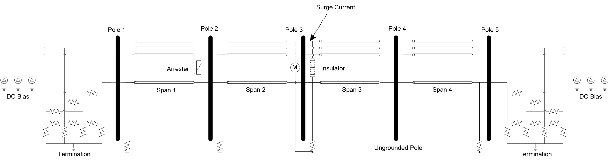
.. |image1| image:: ref/media/image2.png
   :width: 6.63264in
   :height: 1.72917in
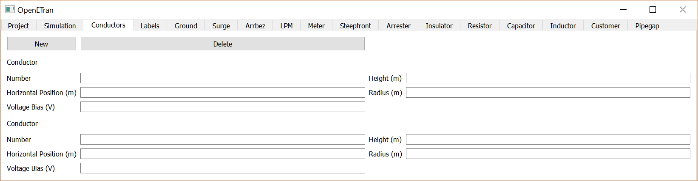
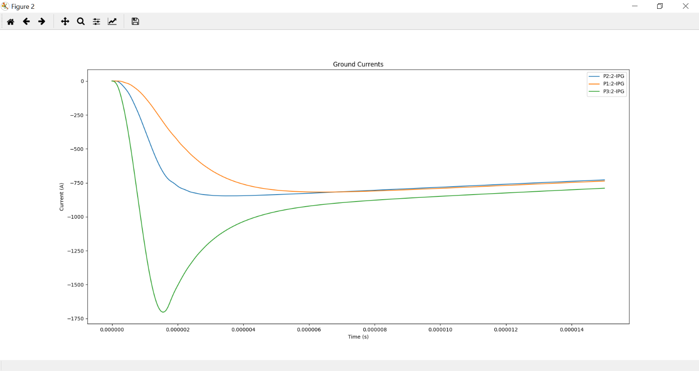
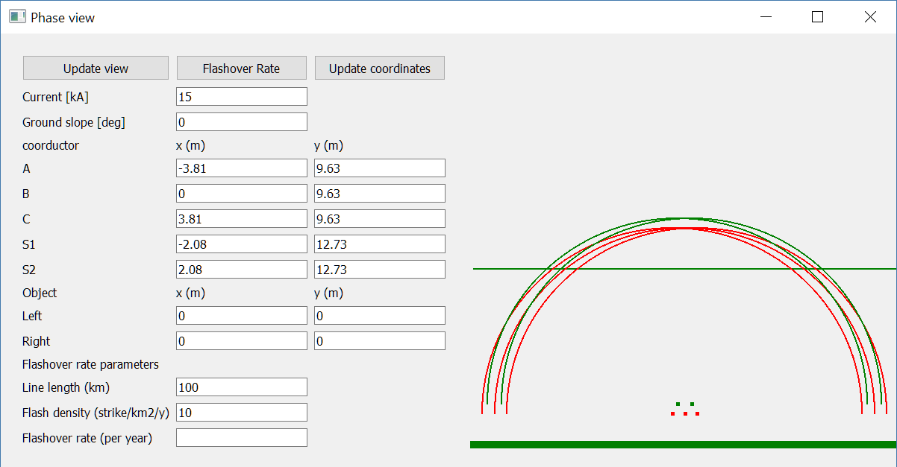
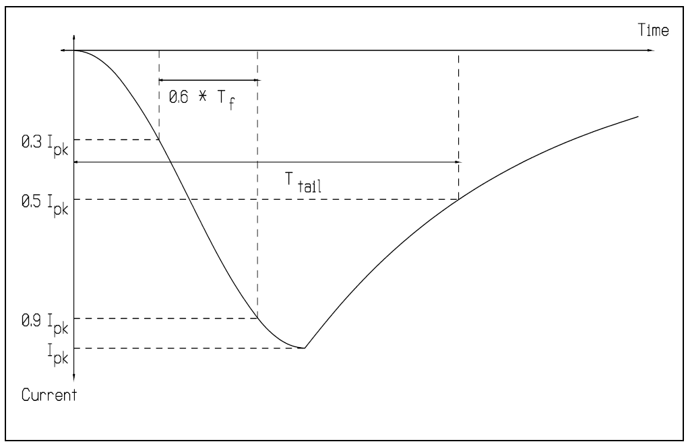
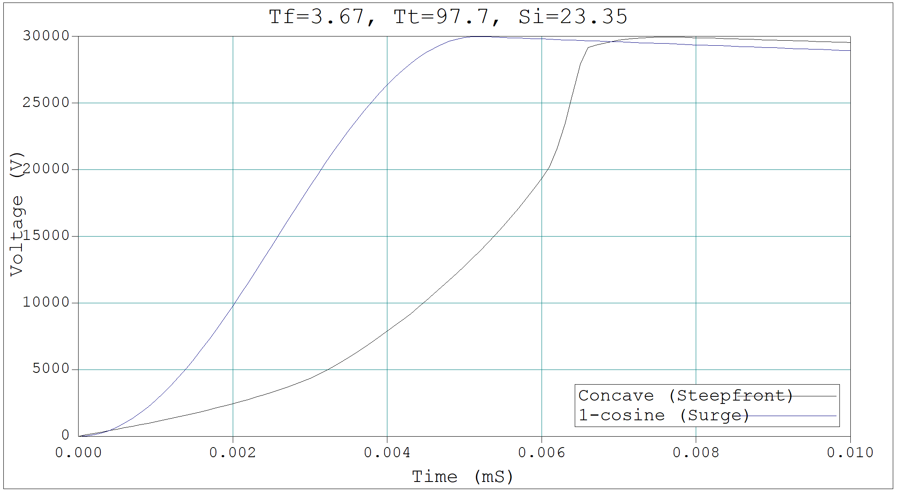
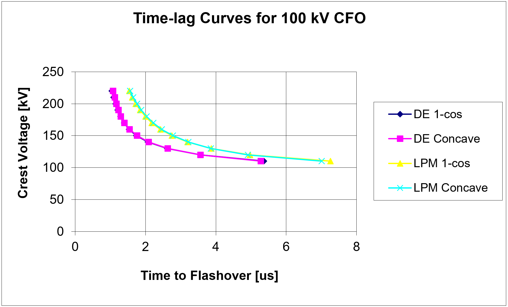
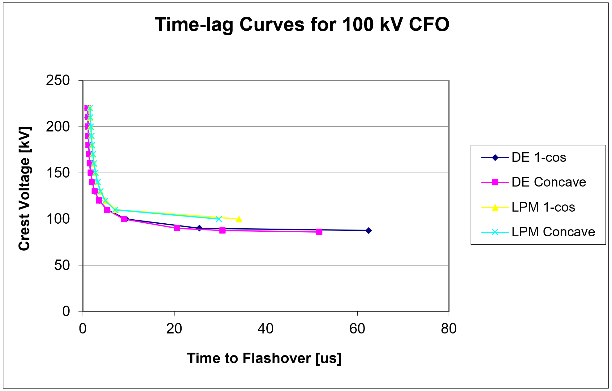
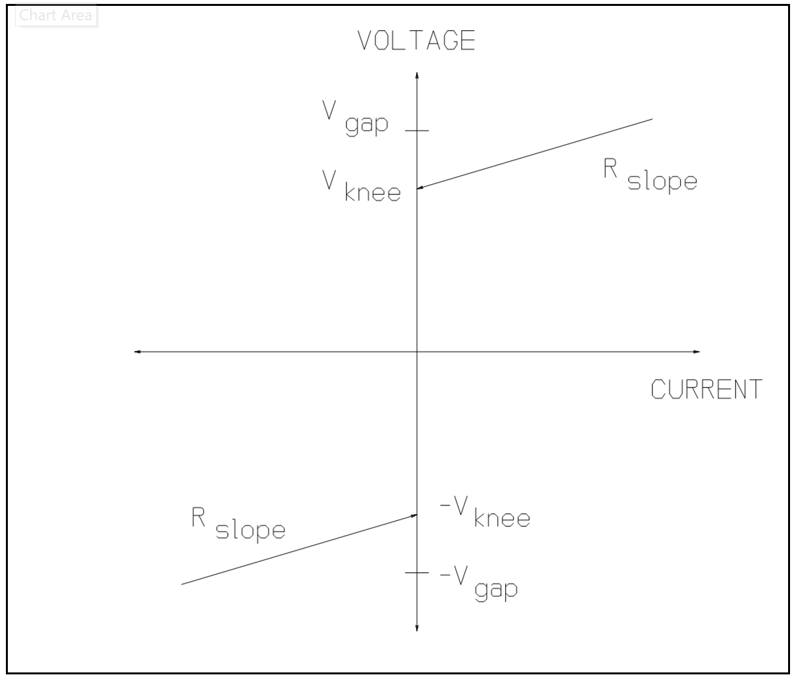
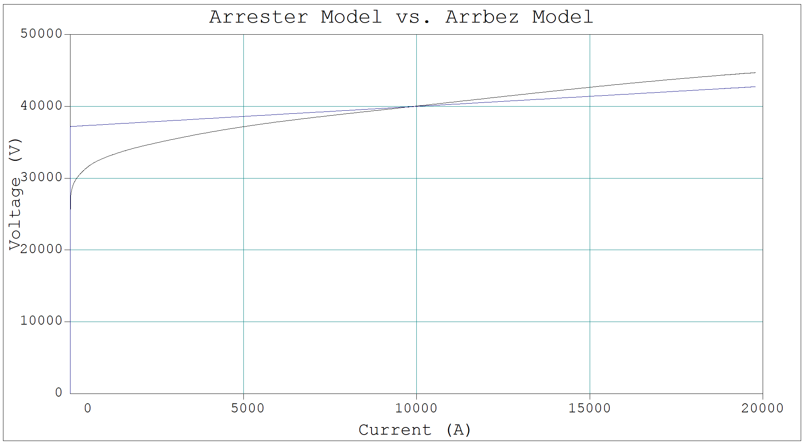
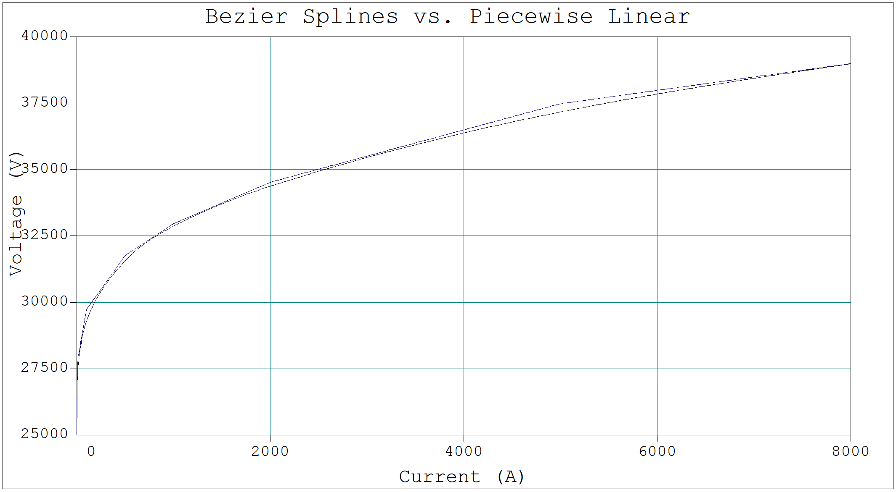
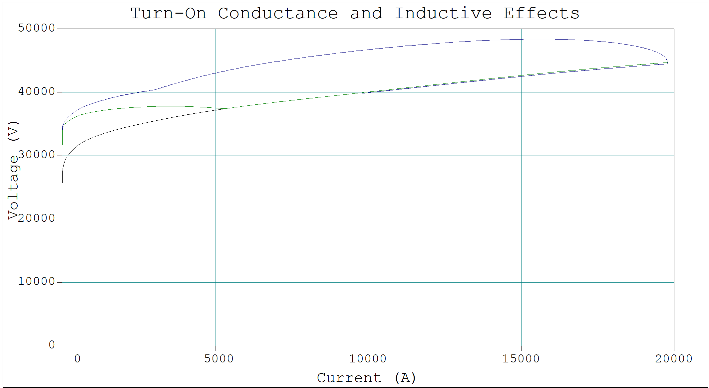
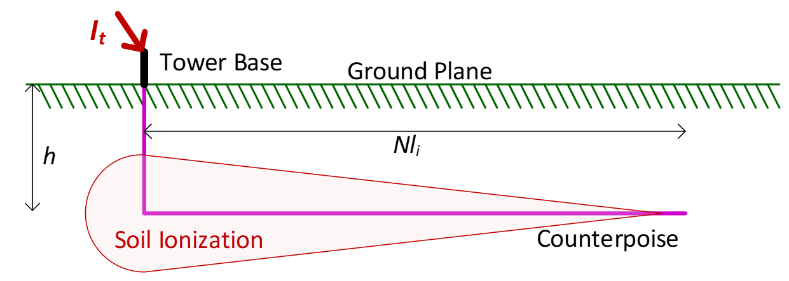
.. |image14| image:: ref/media/image15.png
   :width: 4.05352in
   :height: 1.10384in
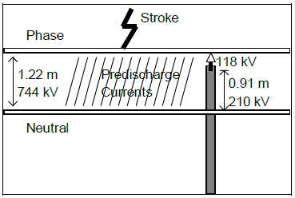
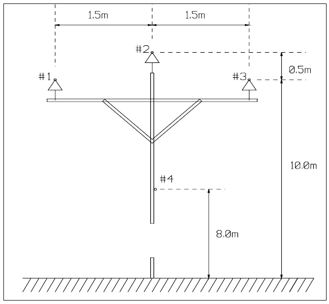
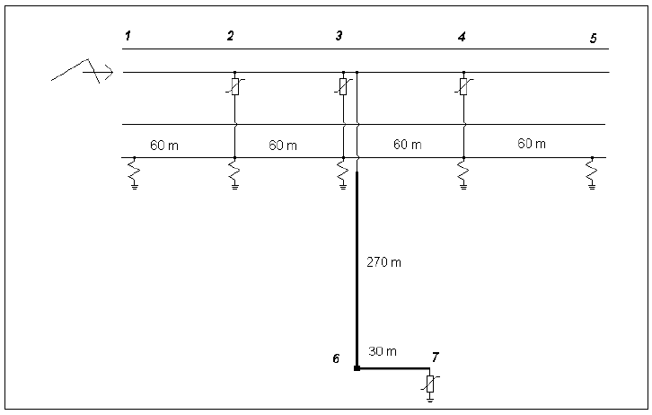
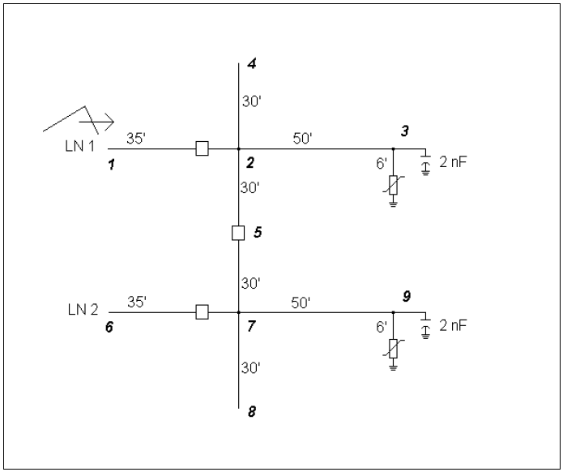
